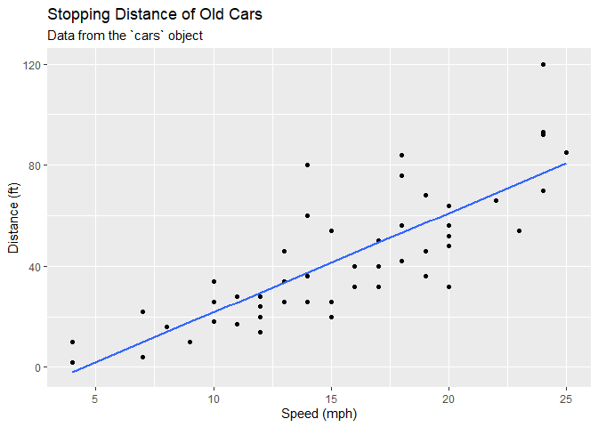
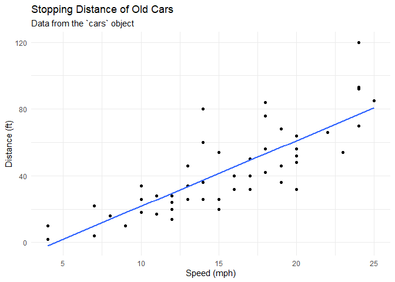
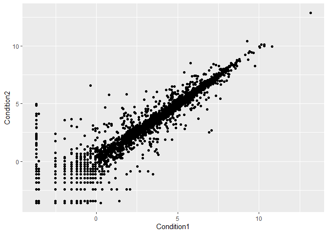
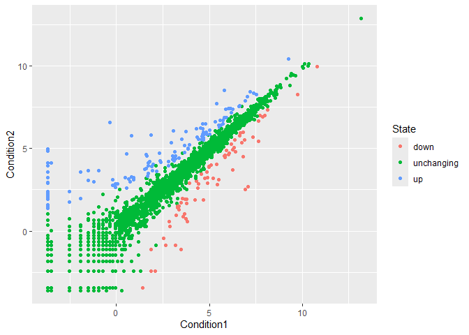
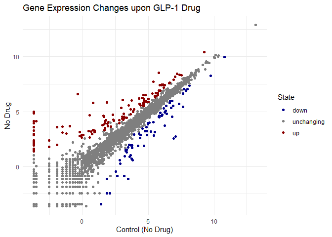
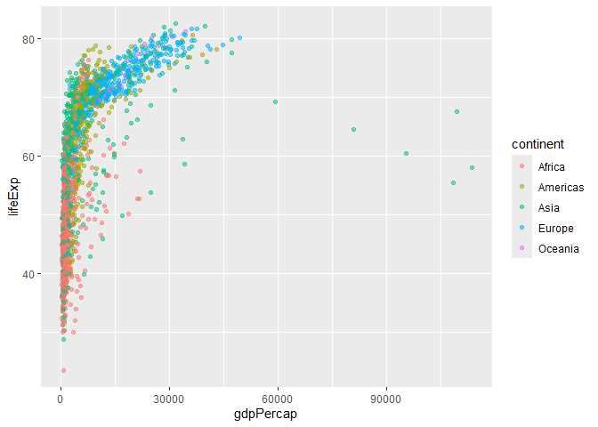
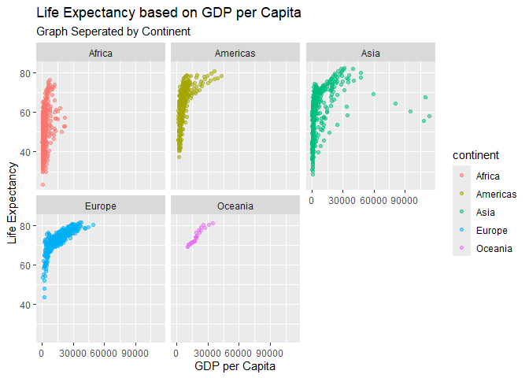
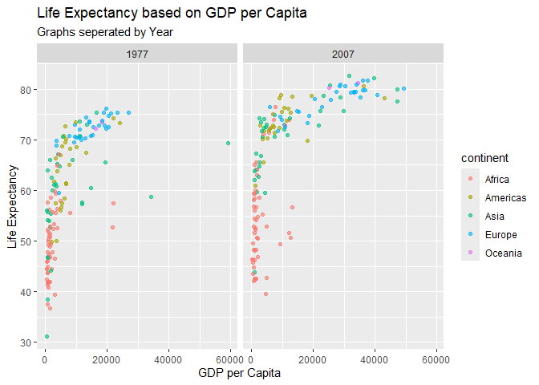

# Class 5: Data Vis with ggplot
Gavin Ambrose (PID: A18548522)

- [Background](#background)
- [Gene expression plot](#gene-expression-plot)
- [Going Further](#going-further)
- [Custom Plot](#custom-plot)

## Background

There are lots of ways to make figures in R. These include so-called
“base R” graphics (e.g. `plot()`) and tons of add-on packages like
**ggplot2**.

For example, here we make the same plot with both:

``` r
head(cars)
```

      speed dist
    1     4    2
    2     4   10
    3     7    4
    4     7   22
    5     8   16
    6     9   10

``` r
plot(cars)
```


First, I need to install the package with the command
`install.packages()`.

> **NB** We never run an installl cmd in a quartro code chunk or we will
> end up re-installing packages many, many times - which is not what we
> want!

Every time we want to use one of these “add-ons” packages, we need to
load it up with the `library()` function.

``` r
library(ggplot2)
```

    Warning: package 'ggplot2' was built under R version 4.4.3

``` r
ggplot(cars)
```


Every ggplot needs at least 3 things:

- The **data**, the stuff you want plotted
- The **aes**thitics, , how the data map to the plot
- The **geom**etry, the type of plot

Add a line to better show relationship between speed and dist wtih
`geom_smooth()` and setting `method = "lm"`

``` r
P <- ggplot(cars) +
  aes(x = speed, y = dist) +
  geom_point() +
  geom_smooth(method = "lm", se= FALSE) +
  labs(title = "Stopping Distance of Old Cars", 
       subtitle = "Data from the `cars` object",
       x = "Speed (mph)",
       y = "Distance (ft)")
```

Titles can be added using the `labs()` function

By saving it as a variable, it doesn’t print the chart, let’s render it
out

``` r
P
```

    `geom_smooth()` using formula = 'y ~ x'



``` r
P + theme_minimal()
```

    `geom_smooth()` using formula = 'y ~ x'



By using `theme_minimal`, it removes the the gray background from the
ggplot

The `plot()` cmd is *less code*, but gives *less formatting options*.
The `ggplot()` cmd is *more code*, but has *more formatting options*
available

## Gene expression plot

We can read the input data from the class website!

``` r
url <- "https://bioboot.github.io/bimm143_S20/class-material/up_down_expression.txt"
genes <- read.delim(url)
head(genes)
```

            Gene Condition1 Condition2      State
    1      A4GNT -3.6808610 -3.4401355 unchanging
    2       AAAS  4.5479580  4.3864126 unchanging
    3      AASDH  3.7190695  3.4787276 unchanging
    4       AATF  5.0784720  5.0151916 unchanging
    5       AATK  0.4711421  0.5598642 unchanging
    6 AB015752.4 -3.6808610 -3.5921390 unchanging

A first version plot

``` r
ggplot(genes,) +
  aes(Condition1, Condition2) +
  geom_point()
```



``` r
table(genes$State)
```


          down unchanging         up 
            72       4997        127 

Version 2, let’s color by `State` so we can see the “up” and “down”
significant genes compared to all the “unchanged” genes

``` r
ggplot(genes,) +
  aes(Condition1, Condition2, col = State) +
  geom_point()
```



Version 3, let’s modify the default colors to something we like.

``` r
ggplot(genes,) +
  aes(Condition1, Condition2, col = State) +
  geom_point() +
  scale_color_manual(values = c("darkblue", "gray50", "darkred")) + labs(x = "Control (No Drug)",y = "No Drug", title = "Gene Expression Changes upon GLP-1 Drug") +
  theme_minimal()
```



## Going Further

Let’s have a look at the famous **gapminder** dataset

``` r
url <- "https://raw.githubusercontent.com/jennybc/gapminder/master/inst/extdata/gapminder.tsv"

gapminder <- read.delim(url)

head(gapminder, 3)
```

          country continent year lifeExp      pop gdpPercap
    1 Afghanistan      Asia 1952  28.801  8425333  779.4453
    2 Afghanistan      Asia 1957  30.332  9240934  820.8530
    3 Afghanistan      Asia 1962  31.997 10267083  853.1007

``` r
ggplot(gapminder) +
  aes(gdpPercap, lifeExp, col = continent) +
geom_point(alpha = 0.5)
```



Let’s “facet” (i.e. make a separate plot) by continent rather than the
big hot mess above.

``` r
ggplot(gapminder) +
  aes(gdpPercap, lifeExp, col = continent) +
geom_point(alpha = 0.5) + 
  facet_wrap(~continent) + 
  labs(x = "GDP per Capita", y = "Life Expectancy", title = "Life Expectancy based on GDP per Capita", subtitle = "Graph Seperated by Continent")
```



## Custom Plot

How big big is this gapmider data set Use `nrow` to specify the number
of rows in a data set and `ncol` to specify the number of columns in a
dataset

``` r
nrow(gapminder)
```

    [1] 1704

``` r
ncol(gapminder)
```

    [1] 6

I want to “filter” down to a subset of this data. I will use the
**dplyr** package to help me.

First I need to install it and then load it up…
`install.packages("dplyr")` and then `library(dplyr)`

``` r
library(dplyr)
```


    Attaching package: 'dplyr'

    The following objects are masked from 'package:stats':

        filter, lag

    The following objects are masked from 'package:base':

        intersect, setdiff, setequal, union

``` r
gap2007 <- filter(gapminder, year ==2007)
head(gap2007)
```

          country continent year lifeExp      pop  gdpPercap
    1 Afghanistan      Asia 2007  43.828 31889923   974.5803
    2     Albania    Europe 2007  76.423  3600523  5937.0295
    3     Algeria    Africa 2007  72.301 33333216  6223.3675
    4      Angola    Africa 2007  42.731 12420476  4797.2313
    5   Argentina  Americas 2007  75.320 40301927 12779.3796
    6   Australia   Oceania 2007  81.235 20434176 34435.3674

What is the life expectancy of United States and Ireland in 2007?

``` r
filter(gap2007, country == "Ireland")
```

      country continent year lifeExp     pop gdpPercap
    1 Ireland    Europe 2007  78.885 4109086     40676

or

``` r
filter(gapminder, year == 2007, country == "Ireland")
```

      country continent year lifeExp     pop gdpPercap
    1 Ireland    Europe 2007  78.885 4109086     40676

What is the life expectancy in the United states in 2007?

``` r
filter(gapminder, year == 2007, country == "United States")
```

            country continent year lifeExp       pop gdpPercap
    1 United States  Americas 2007  78.242 301139947  42951.65

> Q. Make a plot comparing 1977 and 2007 for all countries

``` r
filter_data <- filter(gapminder, year %in% c(1977, 2007))
ggplot(filter_data) + 
  aes(gdpPercap, lifeExp, col = continent) + 
  geom_point(alpha = 0.6) + 
  facet_wrap(~year) +
  labs(x = "GDP per Capita", y = "Life Expectancy", title = "Life Expectancy based on GDP per Capita", subtitle = "Graphs seperated by Year")
```


