# Class 7: Machine Learning 1
Gavin Ambrose PID: A18548522

- [Background](#background)
- [K-means clustering](#k-means-clustering)
- [Hierarchical clustering](#hierarchical-clustering)
- [Principal Componet Analysis (PCA)](#principal-componet-analysis-pca)
- [Lab assignment](#lab-assignment)
- [Heatmap](#heatmap)
- [PCA to the rescue](#pca-to-the-rescue)
- [Diggin deeper (variable loadings)](#diggin-deeper-variable-loadings)

## Background

Today we will begin our exploration of important machine learning
methods with a focus on **clustering** and **dimensionality reduction**.

To start testing these methods, let’s make up some sample data to
cluster, where we know what the answer should be.

``` r
hist( rnorm(3000, mean = c(10)) )
```

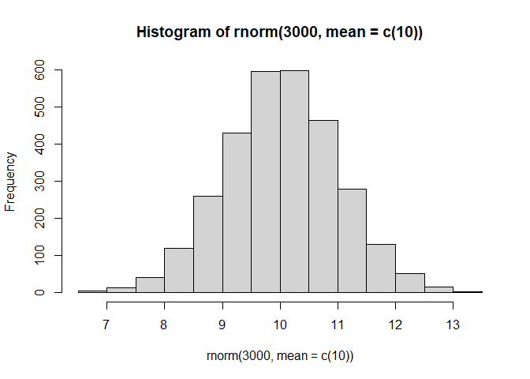

> Q. Can you generate 30 numbers centered at +3 and 30 numbers at -3
> taken at random from a normal distribution

``` r
tmp <- c(rnorm(n = 30, mean = 3 ), rnorm(n=30, mean = -3))

x <- cbind(x=tmp, y=rev(tmp))

plot(x)
```

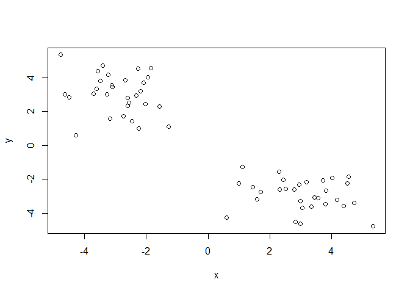

## K-means clustering

The mainn function in “base R” for K-Means clustering is called
`kmeans()`, let’s try it out.

``` r
k <- kmeans(x, centers = 2)
k
```

    K-means clustering with 2 clusters of sizes 30, 30

    Cluster means:
              x         y
    1 -2.907949  3.044785
    2  3.044785 -2.907949

    Clustering vector:
     [1] 2 2 2 2 2 2 2 2 2 2 2 2 2 2 2 2 2 2 2 2 2 2 2 2 2 2 2 2 2 2 1 1 1 1 1 1 1 1
    [39] 1 1 1 1 1 1 1 1 1 1 1 1 1 1 1 1 1 1 1 1 1 1

    Within cluster sum of squares by cluster:
    [1] 64.67808 64.67808
     (between_SS / total_SS =  89.2 %)

    Available components:

    [1] "cluster"      "centers"      "totss"        "withinss"     "tot.withinss"
    [6] "betweenss"    "size"         "iter"         "ifault"      

> Q. What component of your kmeans result object has the cluster
> centers?

``` r
k$centers
```

              x         y
    1 -2.907949  3.044785
    2  3.044785 -2.907949

> Q. What component of your kmeans result object has the cluster size?
> (i.e. how many points are in each cluster)?

``` r
k$size
```

    [1] 30 30

> Q. What component of your kmeans result object has the cluster
> memborship vector (i.e. the main clustering result: which points are
> in which cluster)?

``` r
k$cluster
```

     [1] 2 2 2 2 2 2 2 2 2 2 2 2 2 2 2 2 2 2 2 2 2 2 2 2 2 2 2 2 2 2 1 1 1 1 1 1 1 1
    [39] 1 1 1 1 1 1 1 1 1 1 1 1 1 1 1 1 1 1 1 1 1 1

> Q. Plot the results of clustering (i.e. our data colored by the
> clustering result) along with the cluster centers.

``` r
plot(x, col = k$cluster)
points(x = k$centers, col = "blue", pch = 15, cex = 2)
```

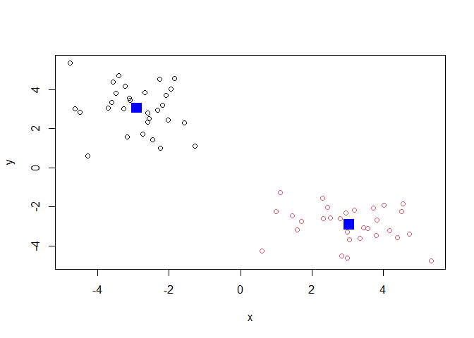

> Q. Can you run `kmeans()` and cluster into 4 clusters and plot the
> results just like we did with coloring by cluster and the cluster
> centers shown in blue

``` r
k2 <- kmeans(x, centers = 4)

plot(x, col = k2$cluster)
points(x = k2$centers, col = "blue", pch = 15, cex = 2)
```

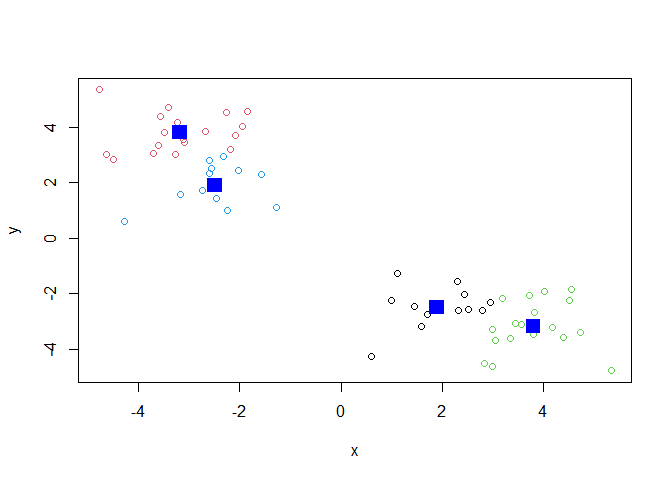

> **Key Points** Kmeans will always return the clustering that we ask
> for (this is the “K” or “centers” in K-means). It does not find a
> structure in the data, but imposes a structure on the data!

``` r
k$tot.withinss
```

    [1] 129.3562

## Hierarchical clustering

The main function for Hierarchical clustering in base R is called
`hclust()`. One of the main differences with respect to the `kmeans()`
function is that you cannot just pass your inout data directly into
`hclust()`. It needs a “distance matrix” as input. We can get this from
lots of places including the `dist()` function.

``` r
d <- dist(x)
hc <- hclust(d)
plot(hc)
```

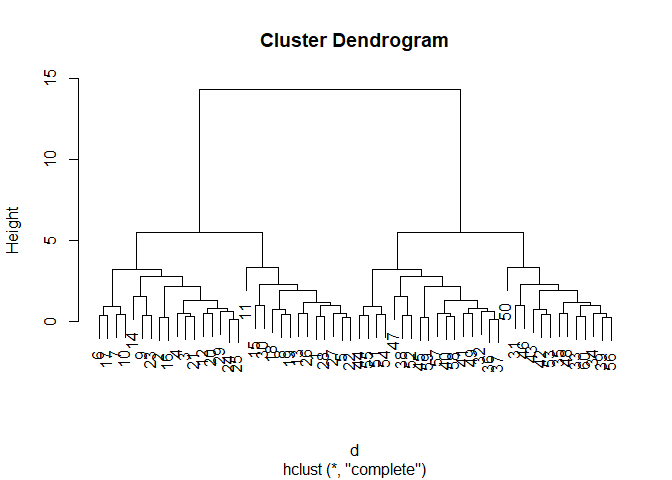

We can “cut the dendrogram or”tree at a given height to yeild our
“clusters. For this we use the function `cutree()`.

``` r
plot(hc)
abline(h=10, col = "red")
```

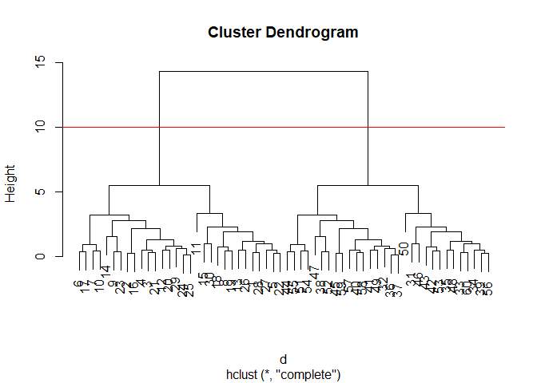

``` r
grps <- cutree(hc, h = 10)
grps
```

     [1] 1 1 1 1 1 1 1 1 1 1 1 1 1 1 1 1 1 1 1 1 1 1 1 1 1 1 1 1 1 1 2 2 2 2 2 2 2 2
    [39] 2 2 2 2 2 2 2 2 2 2 2 2 2 2 2 2 2 2 2 2 2 2

> Q. Plot our data `x` colored by the clustering fesults from `hclust()`
> and `cutree()`

``` r
plot(x, col = grps)
```

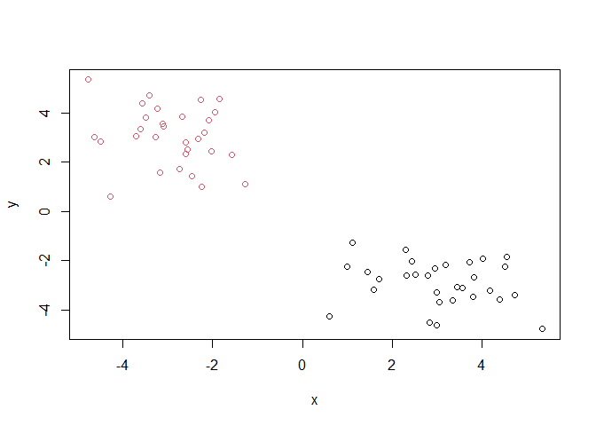

## Principal Componet Analysis (PCA)

PCA is a popular dimensionality reduction technique that is widely used
in bioinformatics.

## Lab assignment

Let’s read the data into R:

``` r
url <- "https://tinyurl.com/UK-foods"
fooddf <- read.csv(url)
dim(fooddf)
```

    [1] 17  5

> Q1. How many rows and columns are in your new data frame named x? What
> R functions could you use to answer this questions?

> A1. 17 rows and 5 columns

It looks like the row names are not set properly. We can fix this

``` r
head(fooddf)
```

                   X England Wales Scotland N.Ireland
    1         Cheese     105   103      103        66
    2  Carcass_meat      245   227      242       267
    3    Other_meat      685   803      750       586
    4           Fish     147   160      122        93
    5 Fats_and_oils      193   235      184       209
    6         Sugars     156   175      147       139

``` r
#rownames(fooddf) <- x[,1]
#fooddf2 <- fooddf[,-1]
#head(fooddf2)
#dim(fooddf2)
```

A better way to do this is fix the row names assignment at import time:

``` r
y <- read.csv(url, row.names=1)
head(y)
```

                   England Wales Scotland N.Ireland
    Cheese             105   103      103        66
    Carcass_meat       245   227      242       267
    Other_meat         685   803      750       586
    Fish               147   160      122        93
    Fats_and_oils      193   235      184       209
    Sugars             156   175      147       139

> Q2. Q2. Which approach to solving the ‘row-names problem’ mentioned
> above do you prefer and why? Is one approach more robust than another
> under certain circumstances?

> A1. I prefer the `row.names` method because it is less code and
> preforms the same function in a manner that makes more sense to me.
> However, the second method is more robust because it allows for
> repeated use without the unintentional changing of the data frame in a
> manner that is not beneficial.

``` r
barplot(as.matrix(y), beside=T, col=rainbow(nrow(y)))
```

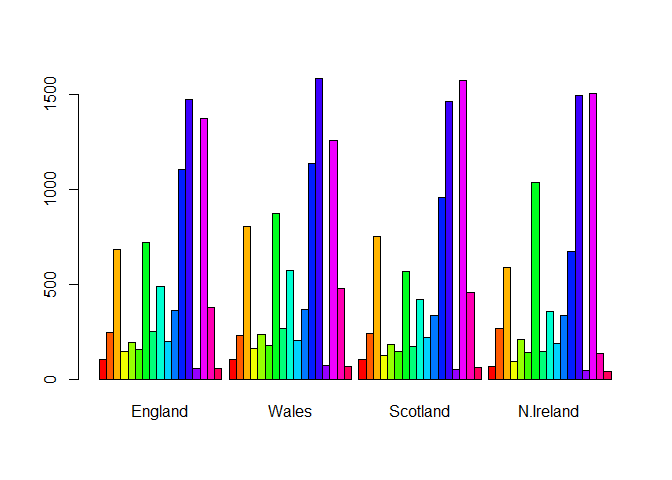

> Q3: Changing what optional argument in the above barplot() function
> results in the following plot?

``` r
barplot(as.matrix(y), col=rainbow(nrow(y)))
```


> A3. The `beside=T` is the optional argument results in the above
> graph.

``` r
library(tidyr)

y_long <- y |> 
          tibble::rownames_to_column("Food") |> 
          pivot_longer(cols = -Food, 
                       names_to = "Country", 
                       values_to = "Consumption")

dim(y_long)
```

    [1] 68  3

``` r
library(ggplot2)
```

    Warning: package 'ggplot2' was built under R version 4.4.3

``` r
ggplot(y_long) +
  aes(x = Country, y = Consumption, fill = Food) +
  geom_col(position = "dodge") +
  theme_bw()
```

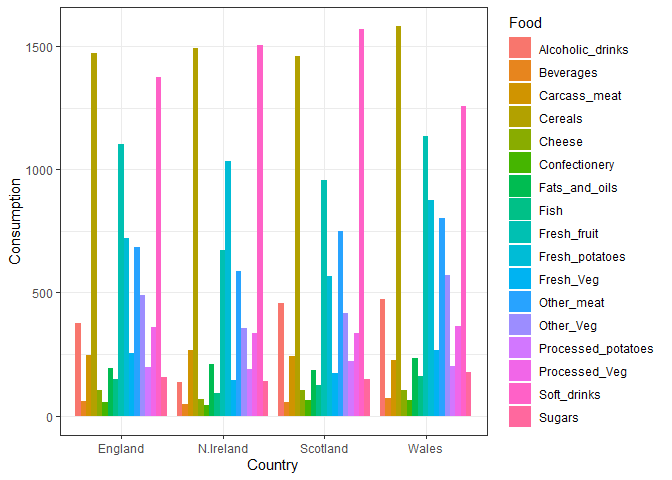

> Q4: Changing what optional argument in the above ggplot() code results
> in a stacked barplot figure?

``` r
ggplot(y_long) +
  aes(x = Country, y = Consumption, fill = Food) +
  geom_col() +
  theme_bw()
```

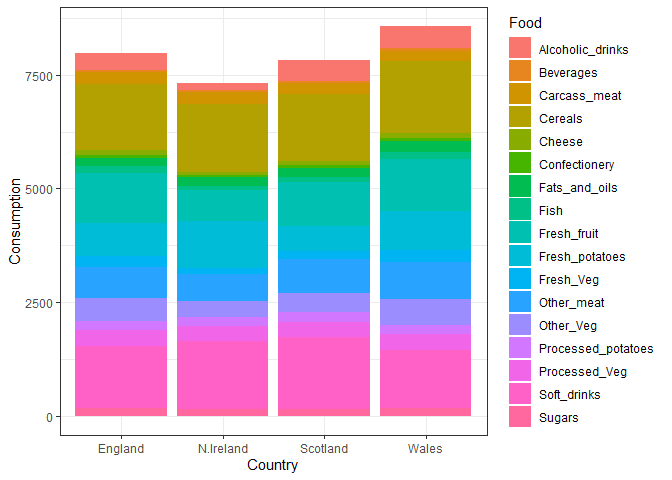

> A4. Removing the `position = "dodge"` optional argument results in the
> above graph.

> Q5. Q5: We can use the pairs() function to generate all pairwise plots
> for our countries. Can you make sense of the following code and
> resulting figure? What does it mean if a given point lies on the
> diagonal for a given plot?

``` r
pairs(x, col=rainbow(nrow(x)), pch=16)
```

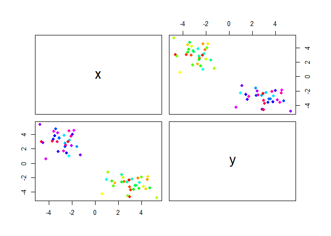

> A5. The horizontal axis represent the country that is present within
> that row. Each plot compares one country to another. The points are
> the categories that we are comparing across the countrie (i.e. cheese,
> alcohol, etc.). A perfect diagnol would signal the same consumption as
> the other country. A value above/below the diagnol would signal
> greater consumption for the associated country (in row/in column
> respectively).

## Heatmap

``` r
#install.packages("pheatmap")
library(pheatmap)
```

    Warning: package 'pheatmap' was built under R version 4.4.3

``` r
pheatmap( as.matrix(x) )
```

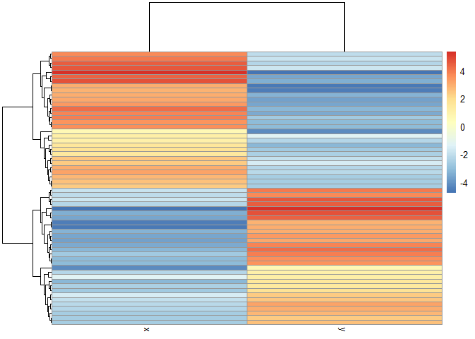

> Q6. Based on the pairs and heatmap figures, which countries cluster
> together and what does this suggest about their food consumption
> patterns? Can you easily tell what the main differences between N.
> Ireland and the other countries of the UK in terms of this data-set?

> A6. It is possible to tell relative consumption to other countries
> based on the legend, but it does not easily show differences in
> specific consumption.

Of all these plot really only the `pairs()` plot was useful. This
however, took a vit of work to interpret and will at scale when I am
looking at much bigger datasets

## PCA to the rescue

The main function in “base R’ for PCA is called `prcomp()`.

``` r
pca <- prcomp( t(y) )
summary(pca)
```

    Importance of components:
                                PC1      PC2      PC3       PC4
    Standard deviation     324.1502 212.7478 73.87622 3.176e-14
    Proportion of Variance   0.6744   0.2905  0.03503 0.000e+00
    Cumulative Proportion    0.6744   0.9650  1.00000 1.000e+00

> Q. How much variance is captured in the first variance?

67.44%

> Q. How many PC’s do I need to capture at least 90% of the total
> variance in the data set?

2 PC’s are needed for capturing of 90% variance

> Q7. Complete the code below to generate a plot of PC1 vs PC2. The
> second line adds text labels over the data points.

``` r
df <- as.data.frame(pca$x)
df$Country <- rownames(df)

# Plot PC1 vs PC2 with ggplot
ggplot(pca$x) +
  aes(x = PC1, y = PC2, label = rownames(pca$x)) +
  geom_point(size = 3) +
  geom_text(vjust = -0.5) +
  xlim(-270, 500) +
  xlab("PC1") +
  ylab("PC2") +
  theme_bw() 
```


> Q8. Customize your plot so that the colors of the country names match
> the colors in our UK and Ireland map and table at start of this
> document.

``` r
# Plot PC1 vs PC2 with ggplot
ggplot(pca$x) +
  aes(x = PC1, y = PC2, label = rownames(pca$x), col = rownames(pca$x)) +
  geom_point(size = 3) +
  geom_text(vjust = -0.5) +
  xlim(-270, 500) +
  xlab("PC1") +
  ylab("PC2") +
  theme_bw()
```

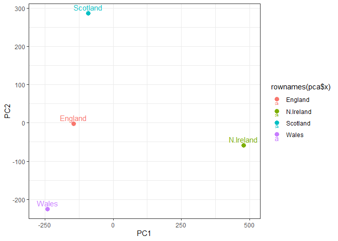

## Diggin deeper (variable loadings)

How do the original variables (i.e. the 17 different foods) contribute
to our new PC’s?

> Q9: Generate a similar ‘loadings plot’ for PC2. What two food groups
> feature prominantely and what does PC2 maninly tell us about?

``` r
ggplot(pca$rotation) +
  aes(x = PC2, 
      y = reorder(rownames(pca$rotation), PC2)) +
  geom_col(fill = "steelblue") +
  xlab("PC2 Loading Score") +
  ylab("") +
  theme_bw() +
  theme(axis.text.y = element_text(size = 9))
```


