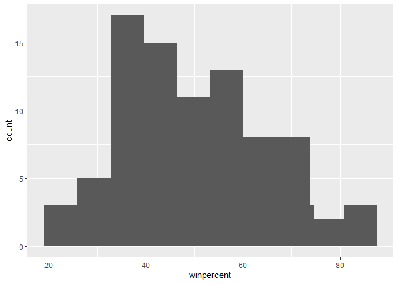
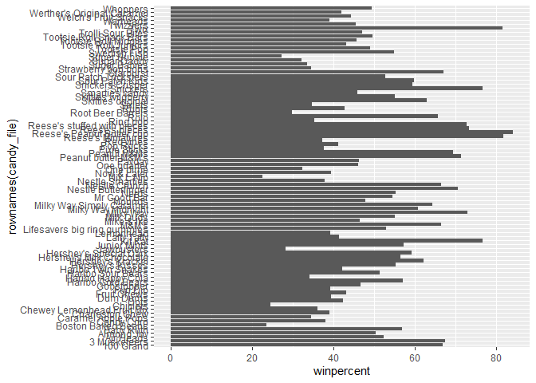
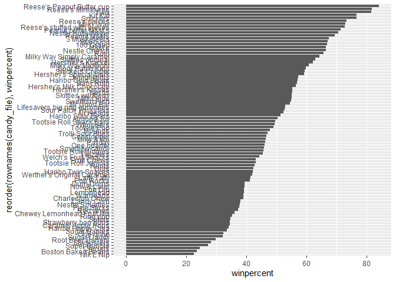
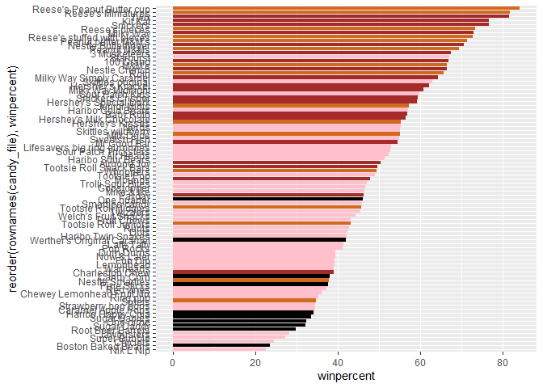
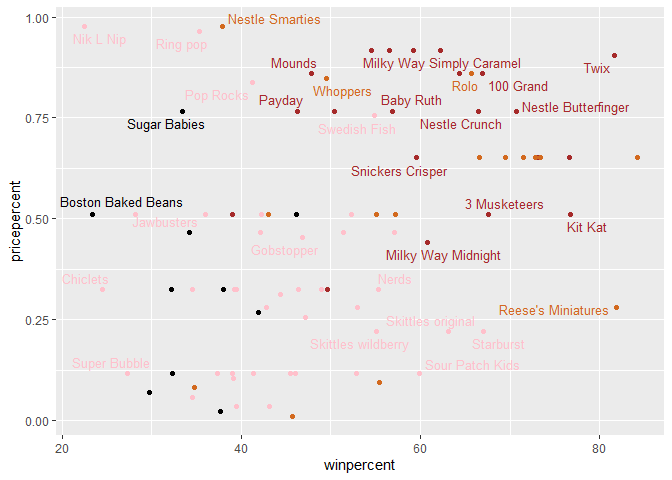
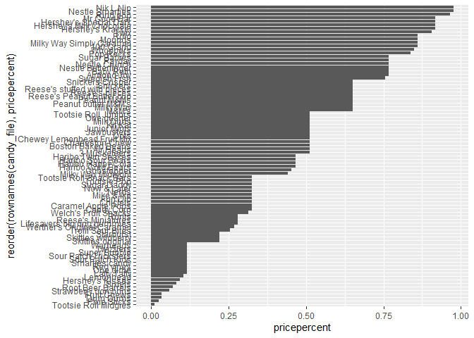
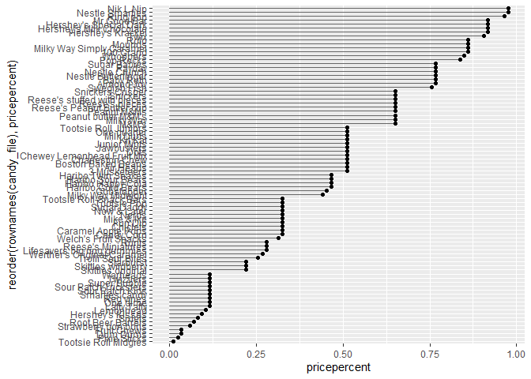
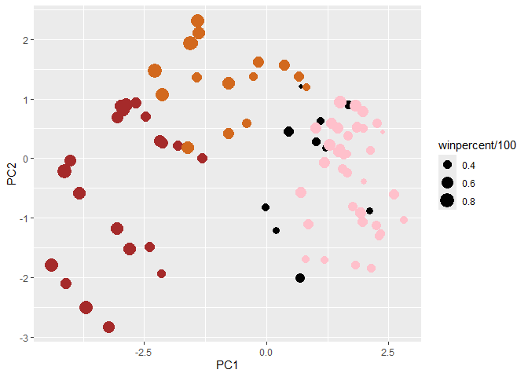
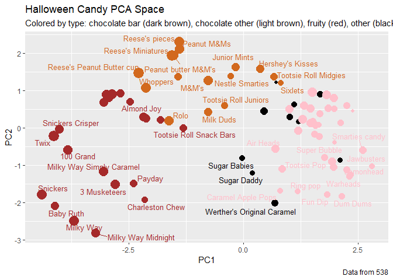
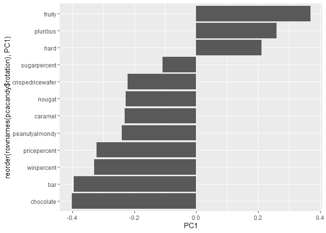

# Class9Candy_Project
Gavin Ambrose PID A18548522

- [Importing candy data](#importing-candy-data)
- [What is in the dataset](#what-is-in-the-dataset)
- [What is your favorite candy?](#what-is-your-favorite-candy)
- [Exploratory analysis](#exploratory-analysis)
- [Overall Candy Rankings](#overall-candy-rankings)
- [Time to add some useful color](#time-to-add-some-useful-color)
- [Taking a look at pricepercent](#taking-a-look-at-pricepercent)
- [Make a lollipop chart of
  pricepercent](#make-a-lollipop-chart-of-pricepercent)
- [Exploring the correlation
  structure](#exploring-the-correlation-structure)
- [Principal Component Analysis](#principal-component-analysis)
- [Summary](#summary)

## Importing candy data

First things first, let’s get the data from the FiveThirtyEight GitHub
repo

``` r
candy_file <- read.csv("https://raw.githubusercontent.com/fivethirtyeight/data/master/candy-power-ranking/candy-data.csv", row.names = 1)

head(candy_file)
```

                 chocolate fruity caramel peanutyalmondy nougat crispedricewafer
    100 Grand            1      0       1              0      0                1
    3 Musketeers         1      0       0              0      1                0
    One dime             0      0       0              0      0                0
    One quarter          0      0       0              0      0                0
    Air Heads            0      1       0              0      0                0
    Almond Joy           1      0       0              1      0                0
                 hard bar pluribus sugarpercent pricepercent winpercent
    100 Grand       0   1        0        0.732        0.860   66.97173
    3 Musketeers    0   1        0        0.604        0.511   67.60294
    One dime        0   0        0        0.011        0.116   32.26109
    One quarter     0   0        0        0.011        0.511   46.11650
    Air Heads       0   0        0        0.906        0.511   52.34146
    Almond Joy      0   1        0        0.465        0.767   50.34755

## What is in the dataset

The dataset includes all sorts of information about different kinds of
candy. For example, is a candy chocolaty? Does it have nougat? How does
its cost compare to other candies? How many people prefer one candy over
another?

> Q1. How many different candy types are in this dataset?

``` r
str(candy_file)
```

    'data.frame':   85 obs. of  12 variables:
     $ chocolate       : int  1 1 0 0 0 1 1 0 0 0 ...
     $ fruity          : int  0 0 0 0 1 0 0 0 0 1 ...
     $ caramel         : int  1 0 0 0 0 0 1 0 0 1 ...
     $ peanutyalmondy  : int  0 0 0 0 0 1 1 1 0 0 ...
     $ nougat          : int  0 1 0 0 0 0 1 0 0 0 ...
     $ crispedricewafer: int  1 0 0 0 0 0 0 0 0 0 ...
     $ hard            : int  0 0 0 0 0 0 0 0 0 0 ...
     $ bar             : int  1 1 0 0 0 1 1 0 0 0 ...
     $ pluribus        : int  0 0 0 0 0 0 0 1 1 0 ...
     $ sugarpercent    : num  0.732 0.604 0.011 0.011 0.906 ...
     $ pricepercent    : num  0.86 0.511 0.116 0.511 0.511 ...
     $ winpercent      : num  67 67.6 32.3 46.1 52.3 ...

There are 85 different candy types within this dataset

> Q2. How many fruity candy types are in the dataset?

``` r
sum(candy_file$fruity)
```

    [1] 38

There are 38 fruity candy types in the dataset

## What is your favorite candy?

One of the most interesting variables in the dataset is `winpercent`.
For a given candy this value is the percentage of people who prefer this
candy over another randomly chosen candy from the dataset. Higher values
indicate a more popular candy.

> Q3. What is your favorite candy (other than Twix) in the dataset and
> what is it’s winpercent value?

``` r
candy_file["Mike & Ike",]$winpercent
```

    [1] 46.41172

My favorite candy is Mike and Ike’s and they have a winpercent value of
46.411

> Q4. What is the winpercent value for “Kit Kat”?

``` r
candy_file["Kit Kat",]$winpercent
```

    [1] 76.7686

Kit Kat’s have a winpercent of 76.768

> Q5. What is the winpercent value for “Tootsie Roll Snack Bars”?

``` r
candy_file["Tootsie Roll Snack Bars",]$winpercent
```

    [1] 49.6535

Tootsie Roll Snack Bars have a winpercent of 49.653

``` r
library("skimr")
```

    Warning: package 'skimr' was built under R version 4.4.3

``` r
skim(candy_file)
```

|                                                  |            |
|:-------------------------------------------------|:-----------|
| Name                                             | candy_file |
| Number of rows                                   | 85         |
| Number of columns                                | 12         |
| \_\_\_\_\_\_\_\_\_\_\_\_\_\_\_\_\_\_\_\_\_\_\_   |            |
| Column type frequency:                           |            |
| numeric                                          | 12         |
| \_\_\_\_\_\_\_\_\_\_\_\_\_\_\_\_\_\_\_\_\_\_\_\_ |            |
| Group variables                                  | None       |

Data summary

**Variable type: numeric**

| skim_variable | n_missing | complete_rate | mean | sd | p0 | p25 | p50 | p75 | p100 | hist |
|:---|---:|---:|---:|---:|---:|---:|---:|---:|---:|:---|
| chocolate | 0 | 1 | 0.44 | 0.50 | 0.00 | 0.00 | 0.00 | 1.00 | 1.00 | ▇▁▁▁▆ |
| fruity | 0 | 1 | 0.45 | 0.50 | 0.00 | 0.00 | 0.00 | 1.00 | 1.00 | ▇▁▁▁▆ |
| caramel | 0 | 1 | 0.16 | 0.37 | 0.00 | 0.00 | 0.00 | 0.00 | 1.00 | ▇▁▁▁▂ |
| peanutyalmondy | 0 | 1 | 0.16 | 0.37 | 0.00 | 0.00 | 0.00 | 0.00 | 1.00 | ▇▁▁▁▂ |
| nougat | 0 | 1 | 0.08 | 0.28 | 0.00 | 0.00 | 0.00 | 0.00 | 1.00 | ▇▁▁▁▁ |
| crispedricewafer | 0 | 1 | 0.08 | 0.28 | 0.00 | 0.00 | 0.00 | 0.00 | 1.00 | ▇▁▁▁▁ |
| hard | 0 | 1 | 0.18 | 0.38 | 0.00 | 0.00 | 0.00 | 0.00 | 1.00 | ▇▁▁▁▂ |
| bar | 0 | 1 | 0.25 | 0.43 | 0.00 | 0.00 | 0.00 | 0.00 | 1.00 | ▇▁▁▁▂ |
| pluribus | 0 | 1 | 0.52 | 0.50 | 0.00 | 0.00 | 1.00 | 1.00 | 1.00 | ▇▁▁▁▇ |
| sugarpercent | 0 | 1 | 0.48 | 0.28 | 0.01 | 0.22 | 0.47 | 0.73 | 0.99 | ▇▇▇▇▆ |
| pricepercent | 0 | 1 | 0.47 | 0.29 | 0.01 | 0.26 | 0.47 | 0.65 | 0.98 | ▇▇▇▇▆ |
| winpercent | 0 | 1 | 50.32 | 14.71 | 22.45 | 39.14 | 47.83 | 59.86 | 84.18 | ▃▇▆▅▂ |

> Q6. Is there any variable/column that looks to be on a different scale
> to the majority of the other columns in the dataset?

The winpercent column is on a different scale than the majority of the
data because it has a mean data of 50 whereas the others are between
0.08 and 0.4 means.

> Q7. What do you think a zero and one represent for the
> candy\$chocolate column?

I think that a one represents a belonging to that category wheras a 0
represents a lack of belonging to that category

## Exploratory analysis

A good place to start any exploratory analysis is with a histogram.

> Q8. Plot a histogram of winpercent values

``` r
library(ggplot2)
```

    Warning: package 'ggplot2' was built under R version 4.4.3

``` r
ggplot(candy_file) + aes(winpercent) + geom_histogram() + stat_bin (bins = 10)
```

    `stat_bin()` using `bins = 30`. Pick better value `binwidth`.



> Q9. Is the distribution of winpercent values symmetrical?

The histogram is sligthly skewed to the right. Making it assymmetric

> Q10. Is the center of the distribution above or below 50%?

The center of the distributuion is below 50%

> Q11. On average is chocolate candy higher or lower ranked than fruit
> candy?

``` r
mean_chocolate <- mean(candy_file$winpercent[as.logical(candy_file$chocolate)])
mean_chocolate
```

    [1] 60.92153

``` r
mean_fruity <- mean(candy_file$winpercent[as.logical(candy_file$fruity)])
mean_fruity
```

    [1] 44.11974

Chocolate candy has a higher rating than fruity on average

> Q12. Is this difference statistically significant?

``` r
t.test(candy_file$winpercent[as.logical(candy_file$chocolate)], candy_file$winpercent[as.logical(candy_file$fruity)])
```


        Welch Two Sample t-test

    data:  candy_file$winpercent[as.logical(candy_file$chocolate)] and candy_file$winpercent[as.logical(candy_file$fruity)]
    t = 6.2582, df = 68.882, p-value = 2.871e-08
    alternative hypothesis: true difference in means is not equal to 0
    95 percent confidence interval:
     11.44563 22.15795
    sample estimates:
    mean of x mean of y 
     60.92153  44.11974 

We can reject the null hypothesis that there is a difference. The
difference is significant because a p=2.871e-08 \< 0.05

## Overall Candy Rankings

Let’s use the base R order() function together with `head()` to sort the
whole dataset by winpercent. Or if you have been getting into the
tidyverse and the dplyr package you can use the `arrange()` function
together with `head()` to do the same thing and answer the following
questions:

> Q13. What are the five least liked candy types in this set?

``` r
library(dplyr)
```


    Attaching package: 'dplyr'

    The following objects are masked from 'package:stats':

        filter, lag

    The following objects are masked from 'package:base':

        intersect, setdiff, setequal, union

``` r
candy_file |> arrange(winpercent) |> head(5)
```

                       chocolate fruity caramel peanutyalmondy nougat
    Nik L Nip                  0      1       0              0      0
    Boston Baked Beans         0      0       0              1      0
    Chiclets                   0      1       0              0      0
    Super Bubble               0      1       0              0      0
    Jawbusters                 0      1       0              0      0
                       crispedricewafer hard bar pluribus sugarpercent pricepercent
    Nik L Nip                         0    0   0        1        0.197        0.976
    Boston Baked Beans                0    0   0        1        0.313        0.511
    Chiclets                          0    0   0        1        0.046        0.325
    Super Bubble                      0    0   0        0        0.162        0.116
    Jawbusters                        0    1   0        1        0.093        0.511
                       winpercent
    Nik L Nip            22.44534
    Boston Baked Beans   23.41782
    Chiclets             24.52499
    Super Bubble         27.30386
    Jawbusters           28.12744

The five least liked candies are Nik L Nip, Boston Baked Beans,
Chiclets, Super Bubble, and Jawbusters.

> Q14. What are the top 5 all time favorite candy types out of this set?

``` r
candy_file |> arrange(winpercent) |> tail(5)
```

                              chocolate fruity caramel peanutyalmondy nougat
    Snickers                          1      0       1              1      1
    Kit Kat                           1      0       0              0      0
    Twix                              1      0       1              0      0
    Reese's Miniatures                1      0       0              1      0
    Reese's Peanut Butter cup         1      0       0              1      0
                              crispedricewafer hard bar pluribus sugarpercent
    Snickers                                 0    0   1        0        0.546
    Kit Kat                                  1    0   1        0        0.313
    Twix                                     1    0   1        0        0.546
    Reese's Miniatures                       0    0   0        0        0.034
    Reese's Peanut Butter cup                0    0   0        0        0.720
                              pricepercent winpercent
    Snickers                         0.651   76.67378
    Kit Kat                          0.511   76.76860
    Twix                             0.906   81.64291
    Reese's Miniatures               0.279   81.86626
    Reese's Peanut Butter cup        0.651   84.18029

The top 5 of all time are Snickers, Kit Kat, Reese’s Minatures, and
Reese’s Peanut Butter cup.

> Q15. Make a first barplot of candy ranking based on winpercent values.

``` r
ggplot(candy_file) + aes(winpercent, rownames(candy_file)) + geom_col()
```



> Q16. This is quite ugly, use the reorder() function to get the bars
> sorted by winpercent?

``` r
ggplot(candy_file) + aes(winpercent, reorder(rownames(candy_file), winpercent)) + geom_col()
```



## Time to add some useful color

Let’s setup a color vector (that signifies candy type) that we can then
use for some future plots. We start by making a vector of all black
values (one for each candy). Then we overwrite chocolate (for chocolate
candy), brown (for candy bars) and red (for fruity candy) values.

``` r
my_cols=rep("black", nrow(candy_file))
my_cols[as.logical(candy_file$chocolate)] = "chocolate"
my_cols[as.logical(candy_file$bar)] = "brown"
my_cols[as.logical(candy_file$fruity)] = "pink"
```

``` r
ggplot(candy_file) + aes(winpercent, reorder(rownames(candy_file), winpercent)) + geom_col(fill = my_cols)
```



> Q17. What is the worst ranked chocolate candy?

Sixlets

> Q18. What is the best ranked fruity candy?

Starbursts

## Taking a look at pricepercent

What about value for money? What is the best candy for the least money?

``` r
library(ggrepel)
```

    Warning: package 'ggrepel' was built under R version 4.4.3

``` r
# How about a plot of win vs price
ggplot(candy_file) +
  aes(winpercent, pricepercent, label=rownames(candy_file)) +
  geom_point(col=my_cols) + 
  geom_text_repel(col=my_cols, size=3.3, max.overlaps = 5)
```

    Warning: ggrepel: 54 unlabeled data points (too many overlaps). Consider
    increasing max.overlaps



> Q19. Which candy type is the highest ranked in terms of `winpercent`
> for the least money - i.e. offers the most bang for your buck?

``` r
ordleast <- order(candy_file$pricepercent, decreasing = TRUE)
head( candy_file[ordleast,c(11,12)], n=5 )
```

                             pricepercent winpercent
    Nik L Nip                       0.976   22.44534
    Nestle Smarties                 0.976   37.88719
    Ring pop                        0.965   35.29076
    Hershey's Krackel               0.918   62.28448
    Hershey's Milk Chocolate        0.918   56.49050

> Q20. What are the top 5 most expensive candy types in the dataset and
> of these which is the least popular?

``` r
ordmost <- order(candy_file$pricepercent, decreasing = F)
head( candy_file[ordmost,c(11,12)], n=5 )
```

                         pricepercent winpercent
    Tootsie Roll Midgies        0.011   45.73675
    Pixie Sticks                0.023   37.72234
    Dum Dums                    0.034   39.46056
    Fruit Chews                 0.034   43.08892
    Strawberry bon bons         0.058   34.57899

> Q21. Make a barplot again with geom_col() this time using pricepercent
> and then improve this step by step, first ordering the x-axis by value
> and finally making a so called “dot chat” or “lollipop” chart by
> swapping geom_col() for geom_point() + geom_segment().

``` r
ggplot(candy_file) + aes(pricepercent, reorder(rownames(candy_file), pricepercent)) + geom_col()
```



## Make a lollipop chart of pricepercent

``` r
ggplot(candy_file) +
  aes(pricepercent, reorder(rownames(candy_file), pricepercent)) +
  geom_segment(aes(yend = reorder(rownames(candy_file), pricepercent), 
                   xend = 0), col="gray40") +
    geom_point()
```



> One of the most interesting aspects of this chart is that a lot of the
> candies share the same ranking, so it looks like quite a few of them
> are the same price.

## Exploring the correlation structure

Now that we’ve explored the dataset a little, we’ll see how the
variables interact with one another. We’ll use correlation and view the
results with the corrplot package to plot a correlation matrix.

``` r
library(corrplot)
```

    Warning: package 'corrplot' was built under R version 4.4.3

    corrplot 0.95 loaded

``` r
corcandy <- cor(candy_file)
corrplot(corcandy)
```


> Q22. Examining this plot what two variables are anti-correlated
> (i.e. have minus values)?

The two variables that have a strong negative correlation chocolate and
fruity

> Q23. Similarly, what two variables are most positively correlated?

The chocolate variable and the winpercent variable have the strongest
positive correlation.

## Principal Component Analysis

Let’s apply PCA using the prcomp() function to our candy dataset
remembering to set the scale=TRUE argument.

``` r
pcacandy <- prcomp(candy_file, scale = T)
summary(pcacandy)
```

    Importance of components:
                              PC1    PC2    PC3     PC4    PC5     PC6     PC7
    Standard deviation     2.0788 1.1378 1.1092 1.07533 0.9518 0.81923 0.81530
    Proportion of Variance 0.3601 0.1079 0.1025 0.09636 0.0755 0.05593 0.05539
    Cumulative Proportion  0.3601 0.4680 0.5705 0.66688 0.7424 0.79830 0.85369
                               PC8     PC9    PC10    PC11    PC12
    Standard deviation     0.74530 0.67824 0.62349 0.43974 0.39760
    Proportion of Variance 0.04629 0.03833 0.03239 0.01611 0.01317
    Cumulative Proportion  0.89998 0.93832 0.97071 0.98683 1.00000

Let’s plot our main PCA scores (PCA1 and PCA2)

``` r
plot(pcacandy$x[,1:2])
```


We can change the colors and characters

``` r
plot(pcacandy$x[,1:2], col = my_cols, pch = 16)
```


LEt’s try it with ggplot

``` r
my_data <- cbind(candy_file, pcacandy$x[,1:3])
pcaggplot <- ggplot(my_data) + 
        aes(x=PC1, y=PC2, 
            size=winpercent/100,  
            text=rownames(my_data),
            label=rownames(my_data)) +
        geom_point(col=my_cols)
pcaggplot
```



Lets use greppel and label the plot

``` r
pcaggplot + geom_text_repel(size=3.3, col=my_cols, max.overlaps = 7)  + 
  theme(legend.position = "none") +
  labs(title="Halloween Candy PCA Space",
       subtitle="Colored by type: chocolate bar (dark brown), chocolate other (light brown), fruity (red), other (black)",
       caption="Data from 538")
```

    Warning: ggrepel: 43 unlabeled data points (too many overlaps). Consider
    increasing max.overlaps



> Q24. Complete the code to generate the loadings plot above. What
> original variables are picked up strongly by PC1 in the positive
> direction? Do these make sense to you? Where did you see this
> relationship highlighted previously?

``` r
ggplot(pcacandy$rotation) +
  aes(x = PC1, y = reorder(rownames(pcacandy$rotation), PC1)) +
  geom_col()
```



The fruity, pluribis, and hard variables are picked up strongly by the
PCA. These make sense because they are popular charicteristics of candy.
This was highlighted in the previous question that also use bar plots.

## Summary

> Q25. Based on your exploratory analysis, correlation findings, and PCA
> results, what combination of characteristics appears to make a
> “winning” candy? How do these different analyses (visualization,
> correlation, PCA) support or complement each other in reaching this
> conclusion?

Based on visual data, chocolate and bar candies seems to preform the
best, and fruity candies the worst. Positive correlation is associated
with chocolate and bar candies, while a negative correlation is
associated with fruity candies. PC1 has a shows chocolate and bar
variables along one of the axis and fruity and plurabis along a
different axis. These all propose that the “winning” candy is likely a
chocolate candy in a bar form.
