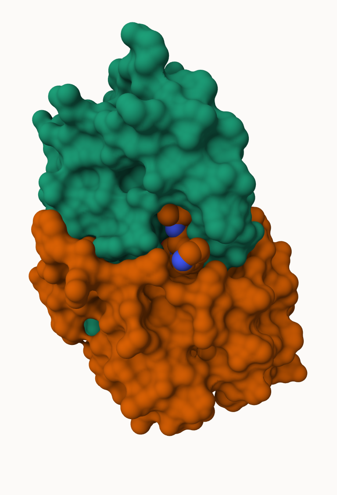
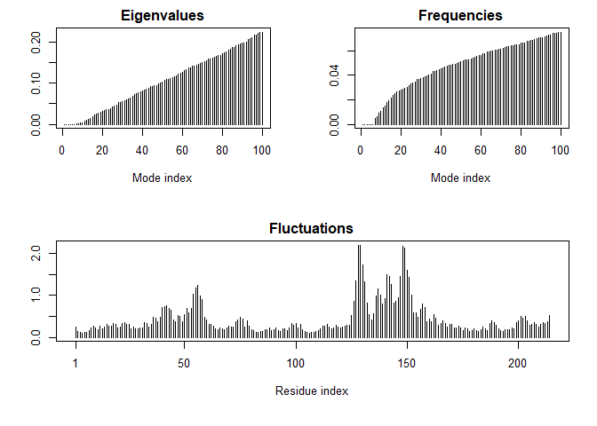

# Class10: Structural Bioinformatics 1
Gavin Ambrose PID: A18548522

- [PDB statistics](#pdb-statistics)
- [Visualizing the HIV-1 protease
  structure](#visualizing-the-hiv-1-protease-structure)
- [Introduction to Bio3D in R](#introduction-to-bio3d-in-r)
- [Predicting functional motions of a single
  structure](#predicting-functional-motions-of-a-single-structure)

## PDB statistics

THe Protein Data Bank (PDB)is the main repository of biomolecular
strucutres. Let’s see what it contains:

Download a CSV file from the PDB site (accessible from “Analyze” \> “PDB
Statistics” \> “by Experimental Method and Molecular Type”

``` r
stats <- read.csv("Data Export Summary.csv")
stats
```

               Molecular.Type   X.ray     EM    NMR Integrative Multiple.methods
    1          Protein (only) 178,795 21,825 12,773         343              226
    2 Protein/Oligosaccharide  10,363  3,564     34           8               11
    3              Protein/NA   9,106  6,335    287          24                7
    4     Nucleic acid (only)   3,132    221  1,566           3               15
    5                   Other     175     25     33           4                0
    6  Oligosaccharide (only)      11      0      6           0                1
      Neutron Other   Total
    1      84    32 214,078
    2       1     0  13,981
    3       0     0  15,759
    4       3     1   4,941
    5       0     0     237
    6       0     4      22

> Q1: What percentage of structures in the PDB are solved by X-Ray and
> Electron Microscopy.

``` r
#sum(stats$X.ray)
```

``` r
sum(stats$Neutron)
```

    [1] 88

The comma in these number leads to the numbers here being read as
characters

``` r
library(readr)
stats <- read_csv("Data Export Summary.csv")
```

    Rows: 6 Columns: 9
    ── Column specification ────────────────────────────────────────────────────────
    Delimiter: ","
    chr (1): Molecular Type
    dbl (4): Integrative, Multiple methods, Neutron, Other
    num (4): X-ray, EM, NMR, Total

    ℹ Use `spec()` to retrieve the full column specification for this data.
    ℹ Specify the column types or set `show_col_types = FALSE` to quiet this message.

``` r
stats
```

    # A tibble: 6 × 9
      `Molecular Type`    `X-ray`    EM   NMR Integrative `Multiple methods` Neutron
      <chr>                 <dbl> <dbl> <dbl>       <dbl>              <dbl>   <dbl>
    1 Protein (only)       178795 21825 12773         343                226      84
    2 Protein/Oligosacch…   10363  3564    34           8                 11       1
    3 Protein/NA             9106  6335   287          24                  7       0
    4 Nucleic acid (only)    3132   221  1566           3                 15       3
    5 Other                   175    25    33           4                  0       0
    6 Oligosaccharide (o…      11     0     6           0                  1       0
    # ℹ 2 more variables: Other <dbl>, Total <dbl>

> Q1: What percentage of structures in the PDB are solved by X-Ray and
> Electron Microscopy.

``` r
(sum(stats$`X-ray`) + sum(stats$EM))/sum(stats$Total)
```

    [1] 0.937892

THe structures of X-ray and Electron Microscopy make up 93.78% of the
data.

> Q2: What proportion of structures in the PDB are protein?

``` r
(stats[1,9])/sum(stats$Total)
```

          Total
    1 0.8596889

The proportion is 85%

> Q3: SKIP… Looking up HIV structures including 1HSG

## Visualizing the HIV-1 protease structure

We can use the Molstar viewer online: https://molstar.org/viewer/



> Q4: Water molecules normally have 3 atoms. Why do we see just one atom
> per water molecule in this structure?

This is because the molecular model is only showing the central oxygen
atom of the water, not the two additional hydrogens

> Q5: There is a critical “conserved” water molecule in the binding
> site. Can you identify this water molecule? What residue number does
> this water molecule have

This water molecule has a residue number of HOH 308

> Q6: Generate and save a figure clearly showing the two distinct chains
> of HIV-protease along with the ligand. You might also consider showing
> the catalytic residues ASP 25 in each chain and the critical water (we
> recommend “Ball & Stick” for these side-chains). Add this figure to
> your Quarto document.


## Introduction to Bio3D in R

``` r
library(bio3d)
```

    Warning: package 'bio3d' was built under R version 4.4.3

``` r
pdb <- read.pdb("1hsg")
```

      Note: Accessing on-line PDB file

``` r
pdb
```


     Call:  read.pdb(file = "1hsg")

       Total Models#: 1
         Total Atoms#: 1686,  XYZs#: 5058  Chains#: 2  (values: A B)

         Protein Atoms#: 1514  (residues/Calpha atoms#: 198)
         Nucleic acid Atoms#: 0  (residues/phosphate atoms#: 0)

         Non-protein/nucleic Atoms#: 172  (residues: 128)
         Non-protein/nucleic resid values: [ HOH (127), MK1 (1) ]

       Protein sequence:
          PQITLWQRPLVTIKIGGQLKEALLDTGADDTVLEEMSLPGRWKPKMIGGIGGFIKVRQYD
          QILIEICGHKAIGTVLVGPTPVNIIGRNLLTQIGCTLNFPQITLWQRPLVTIKIGGQLKE
          ALLDTGADDTVLEEMSLPGRWKPKMIGGIGGFIKVRQYDQILIEICGHKAIGTVLVGPTP
          VNIIGRNLLTQIGCTLNF

    + attr: atom, xyz, seqres, helix, sheet,
            calpha, remark, call

> Q7: How many amino acid residues are there in this pdb object?

There are 128 amino acids

> Q8: Name one of the two non-protein residues?

There is both water molecules and MK1, merk 1

> Q9: How many protein chains are in this structure?

There are 2 protein chains

``` r
head(pdb$atom)
```

      type eleno elety  alt resid chain resno insert      x      y     z o     b
    1 ATOM     1     N <NA>   PRO     A     1   <NA> 29.361 39.686 5.862 1 38.10
    2 ATOM     2    CA <NA>   PRO     A     1   <NA> 30.307 38.663 5.319 1 40.62
    3 ATOM     3     C <NA>   PRO     A     1   <NA> 29.760 38.071 4.022 1 42.64
    4 ATOM     4     O <NA>   PRO     A     1   <NA> 28.600 38.302 3.676 1 43.40
    5 ATOM     5    CB <NA>   PRO     A     1   <NA> 30.508 37.541 6.342 1 37.87
    6 ATOM     6    CG <NA>   PRO     A     1   <NA> 29.296 37.591 7.162 1 38.40
      segid elesy charge
    1  <NA>     N   <NA>
    2  <NA>     C   <NA>
    3  <NA>     C   <NA>
    4  <NA>     O   <NA>
    5  <NA>     C   <NA>
    6  <NA>     C   <NA>

## Predicting functional motions of a single structure

Read an ADK structure from the pdb database

``` r
adk <- read.pdb("6s36")
```

      Note: Accessing on-line PDB file
       PDB has ALT records, taking A only, rm.alt=TRUE

``` r
adk
```


     Call:  read.pdb(file = "6s36")

       Total Models#: 1
         Total Atoms#: 1898,  XYZs#: 5694  Chains#: 1  (values: A)

         Protein Atoms#: 1654  (residues/Calpha atoms#: 214)
         Nucleic acid Atoms#: 0  (residues/phosphate atoms#: 0)

         Non-protein/nucleic Atoms#: 244  (residues: 244)
         Non-protein/nucleic resid values: [ CL (3), HOH (238), MG (2), NA (1) ]

       Protein sequence:
          MRIILLGAPGAGKGTQAQFIMEKYGIPQISTGDMLRAAVKSGSELGKQAKDIMDAGKLVT
          DELVIALVKERIAQEDCRNGFLLDGFPRTIPQADAMKEAGINVDYVLEFDVPDELIVDKI
          VGRRVHAPSGRVYHVKFNPPKVEGKDDVTGEELTTRKDDQEETVRKRLVEYHQMTAPLIG
          YYSKEAEAGNTKYAKVDGTKPVAEVRADLEKILG

    + attr: atom, xyz, seqres, helix, sheet,
            calpha, remark, call

``` r
m <- nma(adk)
```

     Building Hessian...        Done in 0.03 seconds.
     Diagonalizing Hessian...   Done in 0.49 seconds.

``` r
plot(m)
```



Write our our results as a new trajectory/movie of predicted motions
using `mktrj`

``` r
mktrj(m, file="adk_m7.pdb")
```
