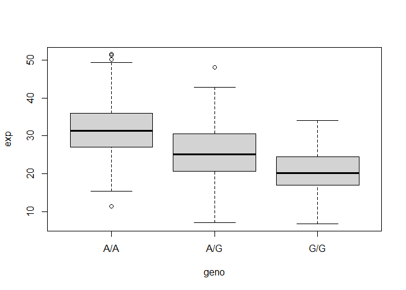
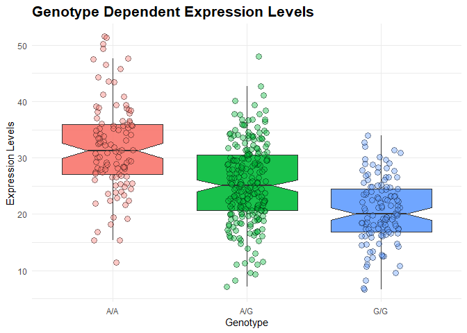

# Class12: Asynchronous Project
Gavin Ambrose PID: A18548522

- [Reading the genotype Data](#reading-the-genotype-data)
- [Section 4: Population Scale Analysis(Homework Questions 13 and
  14)](#section-4-population-scale-analysishomework-questions-13-and-14)

## Reading the genotype Data

We downloaded the data from the OMIM website genotype table.

``` r
genotypeMXL <- read.csv("373531-SampleGenotypes-Homo_sapiens_Variation_Sample_rs8067378.csv")
```

> Q5: What proportion of the Mexican Ancestry in Los Angeles sample
> population (MXL) are homozygous for the asthma associated SNP (G\|G)?

``` r
table(genotypeMXL$Genotype..forward.strand.)
```


    A|A A|G G|A G|G 
     22  21  12   9 

``` r
round(table(genotypeMXL$Genotype..forward.strand.) / nrow(genotypeMXL) * 100, 2)
```


      A|A   A|G   G|A   G|G 
    34.38 32.81 18.75 14.06 

Let’s compare that with the GBR population to see how these numbers
relate.

``` r
genotypeGBR <- read.csv("373522-SampleGenotypes-Homo_sapiens_Variation_Sample_rs8067378.csv")
round(table(genotypeGBR$Genotype..forward.strand.) / nrow(genotypeGBR) * 100, 2)
```


      A|A   A|G   G|A   G|G 
    25.27 18.68 26.37 29.67 

## Section 4: Population Scale Analysis(Homework Questions 13 and 14)

One sample is obviously not enough to know what is happening in a
population. You are interested in assessing genetic differences on a
population scale.

So, you processed about ~230 samples and did the normalization on a
genome level. Now, you want to find whether there is any association of
the 4 asthma-associated SNPs (rs8067378…) on ORMDL3 expression.

> Q13: Read this file into R and determine the sample size for each
> genotype and their corresponding median expression levels for each of
> these genotypes.

``` r
expr <- read.table("Genotype_data_homework.txt")
head(expr)
```

       sample geno      exp
    1 HG00367  A/G 28.96038
    2 NA20768  A/G 20.24449
    3 HG00361  A/A 31.32628
    4 HG00135  A/A 34.11169
    5 NA18870  G/G 18.25141
    6 NA11993  A/A 32.89721

``` r
nrow(expr)
```

    [1] 462

``` r
table(expr$geno)
```


    A/A A/G G/G 
    108 233 121 

``` r
bp <- boxplot(exp ~ geno, data = expr)
```



``` r
round(bp$stats[3, ], 2)
```

    [1] 31.25 25.06 20.07

The sample size for the A/A genotype is 108, the A/G is 233, and the G/G
is 121. The median expression levels for the A/A genotype is 31.25, A/G
is 25.06, and G/G is 20.07.

> Q14: Generate a boxplot with a box per genotype, what could you infer
> from the relative expression value between A/A and G/G displayed in
> this plot? Does the SNP effect the expression of ORMDL3?

``` r
library(ggplot2)
```

    Warning: package 'ggplot2' was built under R version 4.4.3

``` r
ggplot(expr) + 
  aes(x = geno, y = exp, fill = geno) + 
  geom_boxplot(notch = T, outlier.shape = NA, alpha = 0.9) + 
  geom_jitter(aes(fill = geno),
  shape = 21, 
  color = "black",
  stroke = 0.8,      
  width = 0.15,
  size = 2.5,
  alpha = 0.4) +
  theme_minimal() +
  labs( x = "Genotype", y = "Expression Levels", title ="Genotype Dependent Expression Levels") +
  theme( legend.position = "none",  plot.title = element_text(size = 16, face = "bold"))
```



The boxplot shows that ORMDL3 expression is highest in the A/A genotype
and lowest in the G/G genotype, with the A/G genotype showing
intermediate expression. This pattern suggests that the SNP is
associated with differences in ORMDL3 expression and likely has an
additive effect on gene expression.
