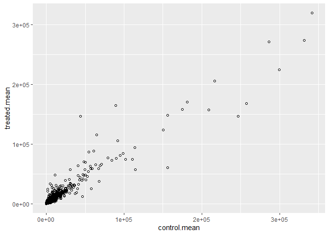
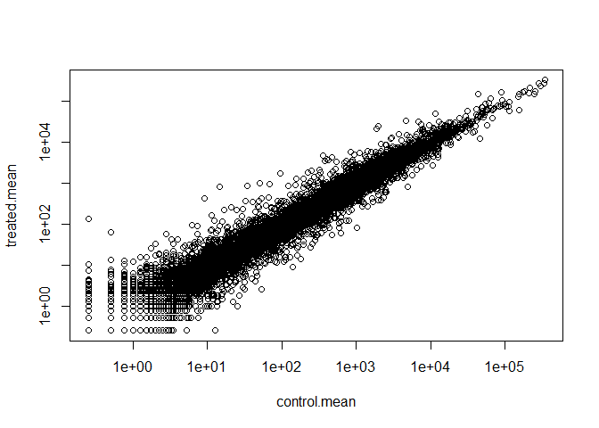
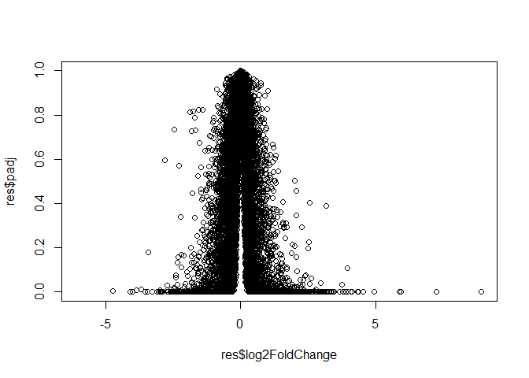
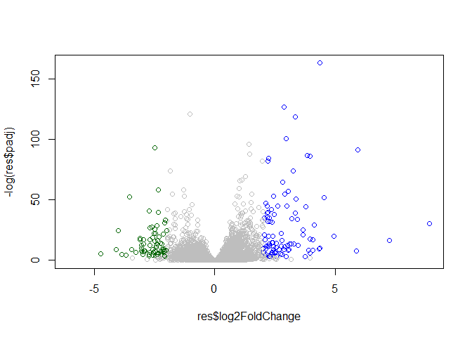
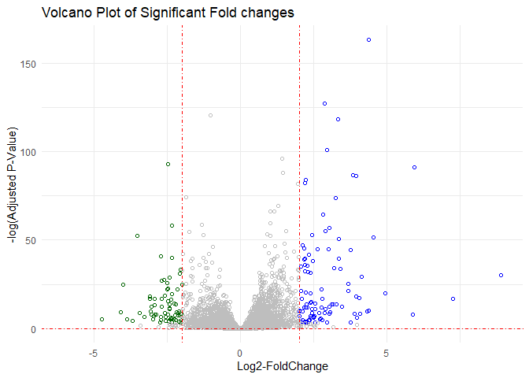
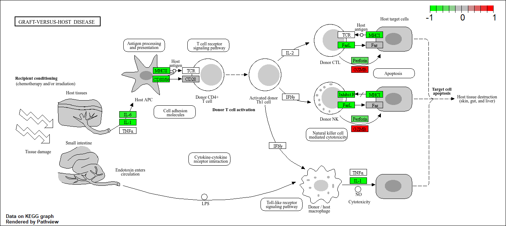

# Class13: Transcriptomics and RNA-Seq data
Gavin Ambrose PID: A18548522

## Background

Today We will perform an RNASeq analysis of the effects of a common
sertoid on airway cells.

In particular, we will be looking at dexamethasone (herafter just called
“dex”) on idfferent airway smooth muscle cell lines (ASM cells).

## Data Import

Wee need two different inputs:

- **countData**: with genes in rows and experiments in columns
- **colData**: meta data that describes the columns in countData

``` r
counts <- read.csv("airway_scaledcounts.csv", row.names = 1)
metadata <- read.csv("airway_metadata.csv")
```

``` r
head(counts)
```

                    SRR1039508 SRR1039509 SRR1039512 SRR1039513 SRR1039516
    ENSG00000000003        723        486        904        445       1170
    ENSG00000000005          0          0          0          0          0
    ENSG00000000419        467        523        616        371        582
    ENSG00000000457        347        258        364        237        318
    ENSG00000000460         96         81         73         66        118
    ENSG00000000938          0          0          1          0          2
                    SRR1039517 SRR1039520 SRR1039521
    ENSG00000000003       1097        806        604
    ENSG00000000005          0          0          0
    ENSG00000000419        781        417        509
    ENSG00000000457        447        330        324
    ENSG00000000460         94        102         74
    ENSG00000000938          0          0          0

``` r
metadata
```

              id     dex celltype     geo_id
    1 SRR1039508 control   N61311 GSM1275862
    2 SRR1039509 treated   N61311 GSM1275863
    3 SRR1039512 control  N052611 GSM1275866
    4 SRR1039513 treated  N052611 GSM1275867
    5 SRR1039516 control  N080611 GSM1275870
    6 SRR1039517 treated  N080611 GSM1275871
    7 SRR1039520 control  N061011 GSM1275874
    8 SRR1039521 treated  N061011 GSM1275875

> Q1: How many genes are in this data set?

``` r
nrow(counts)
```

    [1] 38694

There are 38694 genes

> Q2: How many ‘control’ cell lines do we have

``` r
table(metadata$dex)
```


    control treated 
          4       4 

``` r
sum(metadata$dex == "control")
```

    [1] 4

There are four controls

## Differential Gene Expression

We have 4 replicate treated (drug) and control (no drug)
columns/experiments in our `counts` object.

We want one “mean” value for each gene (rows) in “treated” and one mean
value for each gene in “control” cols.

Step 1. Find all “control” columns in `counts`

``` r
control.inds <- metadata$dex == "control"
```

Step 2. Extract these coulumns from the data matrix into a new object
called `control.counts`

``` r
control.counts <- counts[ ,control.inds]
```

Step 3. Calculate the mean value for each gene

``` r
control.mean <- rowMeans(control.counts)
```

> Q3. How would you make the above code in either approach more robust?
> Is there a function that could help here?

The code is not robust because it relies on positional matching between
metadata and counts. If additional samples are added or the order
changes, the treated columns may be misaligned. A more robust approach
is to align samples by their IDs (using match()) so that the correct
columns are selected regardless of order.

> Q4. Follow the same procedure for the treated samples (i.e. calculate
> the mean per gene across drug treated samples and assign to a labeled
> vector called treated.mean)

> Q. Now do the same thing for the “treated” columns / experiments

``` r
treated.inds <-  metadata$dex == "treated"
treated.counts <- counts[ ,treated.inds]
treated.mean <- rowMeans(treated.counts)
```

> Q5 (a). Create a scatter plot showing the mean of the treated samples
> against the mean of the control samples. Your plot should look
> something like the following.

Let’s generate a quick plot

``` r
meancounts <- data.frame(control.mean,treated.mean)
plot(meancounts)
```


> Q5 (b).You could also use the ggplot2 package to make this figure
> producing the plot below. What geom\_?() function would you use for
> this plot?

``` r
library(ggplot2)
```

    Warning: package 'ggplot2' was built under R version 4.4.3

``` r
ggplot(data = meancounts, aes(x = control.mean, y = treated.mean)) +
  geom_point(shape = 21)
```



`Geom_point(shape = 21)` is needed to create this plot

> Q6. Try plotting both axes on a log scale. What is the argument to
> plot() that allows you to do this?

Let’s log transform this plot

``` r
plot(meancounts, log="xy")
```

    Warning in xy.coords(x, y, xlabel, ylabel, log): 15032 x values <= 0 omitted
    from logarithmic plot

    Warning in xy.coords(x, y, xlabel, ylabel, log): 15281 y values <= 0 omitted
    from logarithmic plot



The argument `log="xy"` is needed to create a log graph of both axis

**N.B** We most often use log2 for this type of data because it makes
the interpretation much more useful

Treated/Control us called “fold-change”

If ther was no change, we would have a log2-fc of zero:

``` r
log2(10/10)
```

    [1] 0

If we had double the amount of transcript around, we would have a
log2-fc of 1:

``` r
log2(20/10)
```

    [1] 1

If we had half as much transcript around, we would have a log2fc of -1:

``` r
log2(5/10)
```

    [1] -1

> . Calculate a log2 fold change value for all our genes and add it as a
> new colun to our `meancounts` object.

``` r
meancounts$log2fc <- log2( meancounts$treated.mean/ meancounts$control.mean)
head(meancounts)
```

                    control.mean treated.mean      log2fc
    ENSG00000000003       900.75       658.00 -0.45303916
    ENSG00000000005         0.00         0.00         NaN
    ENSG00000000419       520.50       546.00  0.06900279
    ENSG00000000457       339.75       316.50 -0.10226805
    ENSG00000000460        97.25        78.75 -0.30441833
    ENSG00000000938         0.75         0.00        -Inf

``` r
zero.vals <- which(meancounts[,1:2]==0, arr.ind=TRUE)

to.rm <- unique(zero.vals[,1])
mycounts <- meancounts[-to.rm,]
head(mycounts)
```

                    control.mean treated.mean      log2fc
    ENSG00000000003       900.75       658.00 -0.45303916
    ENSG00000000419       520.50       546.00  0.06900279
    ENSG00000000457       339.75       316.50 -0.10226805
    ENSG00000000460        97.25        78.75 -0.30441833
    ENSG00000000971      5219.00      6687.50  0.35769358
    ENSG00000001036      2327.00      1785.75 -0.38194109

> Q7. What is the purpose of the arr.ind argument in the which()
> function call above? Why would we then take the first column of the
> output and need to call the unique() function?

`arr.ind = TRUE` makes `which()` return row and column indices instead
of a single vector, allowing us to identify which genes contain zero
values. We then take the first column to get the row indices (genes) and
use `unique()` to avoid listing the same gene multiple times if it has
zeros in both conditions.

``` r
up.ind <- mycounts$log2fc > 2
down.ind <- mycounts$log2fc < (-2)
```

> Q8. Using the up.ind vector above can you determine how many up
> regulated genes we have at the greater than 2 fc level?

``` r
sum(up.ind)
```

    [1] 250

There are 250 up-regulated genes

> Q9. Using the down.ind vector above can you determine how many down
> regulated genes we have at the greater than 2 fc level?

``` r
sum(down.ind)
```

    [1] 367

There are 367 down regulated genes

> Q10. Do you trust these results? Why or why not?

I do not trust these results because the fold change is not compared to
any statistics. We have not compared these changes to a p-value to
determine if they are significant or not. These results are misleading
in their current form.

There are some “funky” log2fc values (Nan and -Inf) here that come about
when ever we have a 0 mean count values. Typically we would remove these
genes from any further analysis - as we can’t say anything about them if
we have no data for them

## DESeq ANalysis

Let’s do this analysis with an estimate of statistical significance
using **DESeq2 package**.

``` r
library(DESeq2)
```

    Warning: package 'matrixStats' was built under R version 4.4.3

DESeq, like many bioconductor packages, want it’s input data in a very
specific way.

``` r
dds <- DESeqDataSetFromMatrix(countData = counts,
                       colData = metadata,
                       design = ~dex)
```

    converting counts to integer mode

    Warning in DESeqDataSet(se, design = design, ignoreRank): some variables in
    design formula are characters, converting to factors

### Run the DESeq analysis pipeline

The main function is called `DESeq()`

``` r
dds <- DESeq(dds)
```

    estimating size factors

    estimating dispersions

    gene-wise dispersion estimates

    mean-dispersion relationship

    final dispersion estimates

    fitting model and testing

``` r
res <- results(dds)
head(res)
```

    log2 fold change (MLE): dex treated vs control 
    Wald test p-value: dex treated vs control 
    DataFrame with 6 rows and 6 columns
                      baseMean log2FoldChange     lfcSE      stat    pvalue
                     <numeric>      <numeric> <numeric> <numeric> <numeric>
    ENSG00000000003 747.194195     -0.3507030  0.168246 -2.084470 0.0371175
    ENSG00000000005   0.000000             NA        NA        NA        NA
    ENSG00000000419 520.134160      0.2061078  0.101059  2.039475 0.0414026
    ENSG00000000457 322.664844      0.0245269  0.145145  0.168982 0.8658106
    ENSG00000000460  87.682625     -0.1471420  0.257007 -0.572521 0.5669691
    ENSG00000000938   0.319167     -1.7322890  3.493601 -0.495846 0.6200029
                         padj
                    <numeric>
    ENSG00000000003  0.163035
    ENSG00000000005        NA
    ENSG00000000419  0.176032
    ENSG00000000457  0.961694
    ENSG00000000460  0.815849
    ENSG00000000938        NA

``` r
36000 * 0.05
```

    [1] 1800

## Volcano Plot

This is a main summary results figure from these kinds of strudies. Its
a plot of Log2-foldchange vs (Adjusted) P-value.

``` r
plot(res$log2FoldChange,
     res$padj)
```



Again, this y-axis is highly skewed and needs log transforming and flip
the y-axis with a minus sign so it looks like every other volcano plot.

``` r
plot(res$log2FoldChange,
     -log(res$padj))
abline(v = -2, col="red") #Setting Threshold for upregulated/downregulate 
abline(v = 2, col="red")
abline(h = -log(0.05), col = "red") #Setting Threshold for Significant gene expression changes
```


### Adding some color annotation

Start with a default base color “gray”

``` r
mycols <-  rep("gray", nrow(res))
mycols[res$log2FoldChange > 2] <- "blue"
mycols[res$log2FoldChange < -2] <- "darkgreen"
mycols[res$padj >= 0.05 ] <- "gray"
plot(res$log2FoldChange,
     -log(res$padj),
     col = mycols)
```



> Q. Make a presentation quality ggplot version of this plot. Include
> clear axis labels, a clean theme, your custom colors, cuti-off lines
> and a plot title.

``` r
mycols <-  rep("gray", nrow(res))
mycols[res$log2FoldChange > 2] <- "blue"
mycols[res$log2FoldChange < -2] <- "darkgreen"
mycols[res$padj >= 0.05 ] <- "gray"

ggplot(res) +
  aes(x=res$log2FoldChange, y= -log(res$padj)) +
  geom_point(shape= 21, col = mycols) +
  geom_abline(intercept = 0.05, slope = 0, lty = 4, col = "red") + 
  geom_vline(xintercept = c(2,-2), lty = 4, col = "red") +
  labs(title = "Volcano Plot of Significant Fold changes", x = "Log2-FoldChange", y = "-log(Adjusted P-Value)") +
  theme_minimal()
```

    Warning: Removed 23549 rows containing missing values or values outside the scale range
    (`geom_point()`).



\##Save our results

Write a CSV file

``` r
write.csv(res, file = "results.csv")
```

## Add annotation data

We need to add missing annotation data to our main `res` results object.
This includes the common gene “symbol”

``` r
head(res)
```

    log2 fold change (MLE): dex treated vs control 
    Wald test p-value: dex treated vs control 
    DataFrame with 6 rows and 6 columns
                      baseMean log2FoldChange     lfcSE      stat    pvalue
                     <numeric>      <numeric> <numeric> <numeric> <numeric>
    ENSG00000000003 747.194195     -0.3507030  0.168246 -2.084470 0.0371175
    ENSG00000000005   0.000000             NA        NA        NA        NA
    ENSG00000000419 520.134160      0.2061078  0.101059  2.039475 0.0414026
    ENSG00000000457 322.664844      0.0245269  0.145145  0.168982 0.8658106
    ENSG00000000460  87.682625     -0.1471420  0.257007 -0.572521 0.5669691
    ENSG00000000938   0.319167     -1.7322890  3.493601 -0.495846 0.6200029
                         padj
                    <numeric>
    ENSG00000000003  0.163035
    ENSG00000000005        NA
    ENSG00000000419  0.176032
    ENSG00000000457  0.961694
    ENSG00000000460  0.815849
    ENSG00000000938        NA

We will use R and bioconductor to do this “ID Mapping”

``` r
res05 <- results(dds, alpha=0.05)
summary(res05)
```


    out of 25258 with nonzero total read count
    adjusted p-value < 0.05
    LFC > 0 (up)       : 1236, 4.9%
    LFC < 0 (down)     : 933, 3.7%
    outliers [1]       : 142, 0.56%
    low counts [2]     : 9033, 36%
    (mean count < 6)
    [1] see 'cooksCutoff' argument of ?results
    [2] see 'independentFiltering' argument of ?results

``` r
library("AnnotationDbi")
library("org.Hs.eg.db")
```

``` r
columns(org.Hs.eg.db)
```

     [1] "ACCNUM"       "ALIAS"        "ENSEMBL"      "ENSEMBLPROT"  "ENSEMBLTRANS"
     [6] "ENTREZID"     "ENZYME"       "EVIDENCE"     "EVIDENCEALL"  "GENENAME"    
    [11] "GENETYPE"     "GO"           "GOALL"        "IPI"          "MAP"         
    [16] "OMIM"         "ONTOLOGY"     "ONTOLOGYALL"  "PATH"         "PFAM"        
    [21] "PMID"         "PROSITE"      "REFSEQ"       "SYMBOL"       "UCSCKG"      
    [26] "UNIPROT"     

We can use the `mapIds()` function to “translate” between any of these
databases.

``` r
res$symbol <- mapIds(org.Hs.eg.db,
                     keys=row.names(res), # Our genenames
                     keytype="ENSEMBL",   # The format of our genenames
                     column="SYMBOL")     # The new format we want to add
```

    'select()' returned 1:many mapping between keys and columns

> Q. Also add “ENTREZID”, GENENAME”

> Q11. Run the mapIds() function two more times to add the Entrez ID and
> UniProt accession and GENENAME as new columns called
> res$entrez, res$uniprot and res\$genename.

``` r
res$entrez <- mapIds(org.Hs.eg.db,
                     keys=row.names(res),
                     column="ENTREZID",
                     keytype="ENSEMBL")
```

    'select()' returned 1:many mapping between keys and columns

``` r
res$uniprot <- mapIds(org.Hs.eg.db,
                     keys=row.names(res),
                     column="UNIPROT",
                     keytype="ENSEMBL")
```

    'select()' returned 1:many mapping between keys and columns

``` r
res$genename <- mapIds(org.Hs.eg.db,
                     keys=row.names(res),
                     column="GENENAME",
                     keytype="ENSEMBL")
```

    'select()' returned 1:many mapping between keys and columns

``` r
head(res)
```

    log2 fold change (MLE): dex treated vs control 
    Wald test p-value: dex treated vs control 
    DataFrame with 6 rows and 10 columns
                      baseMean log2FoldChange     lfcSE      stat    pvalue
                     <numeric>      <numeric> <numeric> <numeric> <numeric>
    ENSG00000000003 747.194195     -0.3507030  0.168246 -2.084470 0.0371175
    ENSG00000000005   0.000000             NA        NA        NA        NA
    ENSG00000000419 520.134160      0.2061078  0.101059  2.039475 0.0414026
    ENSG00000000457 322.664844      0.0245269  0.145145  0.168982 0.8658106
    ENSG00000000460  87.682625     -0.1471420  0.257007 -0.572521 0.5669691
    ENSG00000000938   0.319167     -1.7322890  3.493601 -0.495846 0.6200029
                         padj      symbol      entrez     uniprot
                    <numeric> <character> <character> <character>
    ENSG00000000003  0.163035      TSPAN6        7105  A0A087WYV6
    ENSG00000000005        NA        TNMD       64102      Q9H2S6
    ENSG00000000419  0.176032        DPM1        8813      H0Y368
    ENSG00000000457  0.961694       SCYL3       57147      X6RHX1
    ENSG00000000460  0.815849       FIRRM       55732      A6NFP1
    ENSG00000000938        NA         FGR        2268      B7Z6W7
                                  genename
                               <character>
    ENSG00000000003          tetraspanin 6
    ENSG00000000005            tenomodulin
    ENSG00000000419 dolichyl-phosphate m..
    ENSG00000000457 SCY1 like pseudokina..
    ENSG00000000460 FIGNL1 interacting r..
    ENSG00000000938 FGR proto-oncogene, ..

## Save annotated results to a CSV file

``` r
write.csv(res, file = "results.annotated.csv")
```

## Pathway Analysis

What known biological oathways do our differential expressed genes
overlap (i.e. play a role in)

There are many bioconductor packages to do this type of analysis.

We will use one of the oldest called **gage** along with **pathview** to
render nice pics of the pathways we find.

We can install these with the command
`BiocManager::install( c("pathview", "gage", "gageData") )`

``` r
library(pathview)
library(gage)
library(gageData)
```

Have a wee peak what is in `gageData`

``` r
# Examine the first 2 pathways in this kegg set for humans
data(kegg.sets.hs)
head(kegg.sets.hs, 2)
```

    $`hsa00232 Caffeine metabolism`
    [1] "10"   "1544" "1548" "1549" "1553" "7498" "9"   

    $`hsa00983 Drug metabolism - other enzymes`
     [1] "10"     "1066"   "10720"  "10941"  "151531" "1548"   "1549"   "1551"  
     [9] "1553"   "1576"   "1577"   "1806"   "1807"   "1890"   "221223" "2990"  
    [17] "3251"   "3614"   "3615"   "3704"   "51733"  "54490"  "54575"  "54576" 
    [25] "54577"  "54578"  "54579"  "54600"  "54657"  "54658"  "54659"  "54963" 
    [33] "574537" "64816"  "7083"   "7084"   "7172"   "7363"   "7364"   "7365"  
    [41] "7366"   "7367"   "7371"   "7372"   "7378"   "7498"   "79799"  "83549" 
    [49] "8824"   "8833"   "9"      "978"   

The main `gage()` function that does the work wants a single vector as
input.

``` r
foldchanges <- res$log2FoldChange
names(foldchanges) <-  res$symbol
head(foldchanges)
```

         TSPAN6        TNMD        DPM1       SCYL3       FIRRM         FGR 
    -0.35070302          NA  0.20610777  0.02452695 -0.14714205 -1.73228897 

The KEGG database uses ENTREZ ids so we need to provide those in our
input vector for **gage**

``` r
names(foldchanges) <- res$entrez
```

No we run `gage()`

``` r
# Get the results
keggres = gage(foldchanges, gsets=kegg.sets.hs)
```

What is in the output object `keggres`

``` r
attributes(keggres)
```

    $names
    [1] "greater" "less"    "stats"  

``` r
# Look at the first three down (less) pathways
head(keggres$less, 3)
```

                                          p.geomean stat.mean        p.val
    hsa05332 Graft-versus-host disease 0.0004250461 -3.473346 0.0004250461
    hsa04940 Type I diabetes mellitus  0.0017820293 -3.002352 0.0017820293
    hsa05310 Asthma                    0.0020045888 -3.009050 0.0020045888
                                            q.val set.size         exp1
    hsa05332 Graft-versus-host disease 0.09053483       40 0.0004250461
    hsa04940 Type I diabetes mellitus  0.14232581       42 0.0017820293
    hsa05310 Asthma                    0.14232581       29 0.0020045888

We can use the `pathview()` function to render a figure of any of these
pathways along with annitation of our DEGs.

Let’s see the hsa05310 Asthma pathway with our DEGs colored up:

``` r
pathview(gene.data=foldchanges, pathway.id="hsa05310")
```

    'select()' returned 1:1 mapping between keys and columns

    Info: Working in directory C:/Users/ambro/OneDrive/Desktop/BIMM143/git_play/bimm143_github/Class13

    Info: Writing image file hsa05310.pathview.png


> Q. Can you render the same and insert here the pathway figures for
> “Graft-versus-host disease” and “Type I diabetes mellitus”

``` r
pathview(gene.data=foldchanges, pathway.id="hsa05332")
```

    'select()' returned 1:1 mapping between keys and columns

    Info: Working in directory C:/Users/ambro/OneDrive/Desktop/BIMM143/git_play/bimm143_github/Class13

    Info: Writing image file hsa05332.pathview.png

``` r
pathview(gene.data=foldchanges, pathway.id="hsa04940")
```

    'select()' returned 1:1 mapping between keys and columns

    Info: Working in directory C:/Users/ambro/OneDrive/Desktop/BIMM143/git_play/bimm143_github/Class13

    Info: Writing image file hsa04940.pathview.png

 
