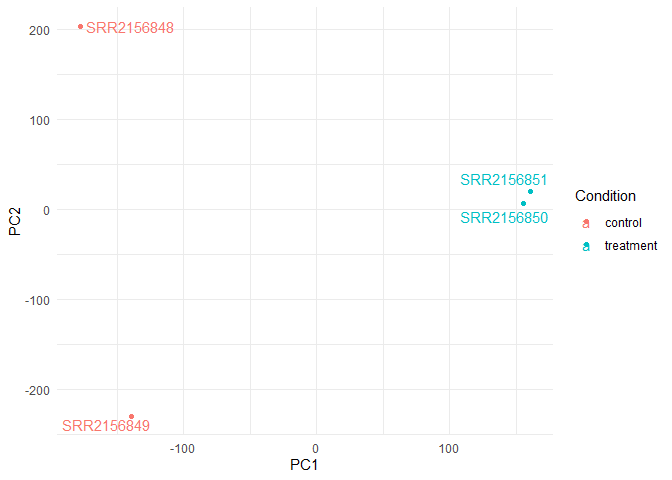
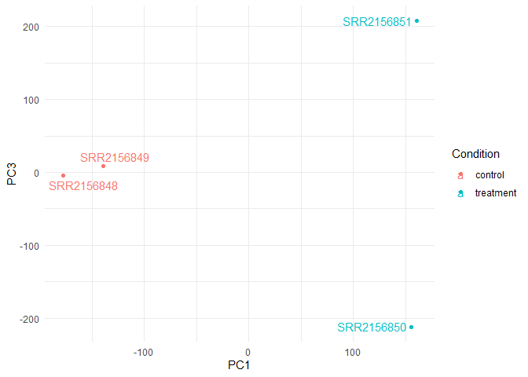
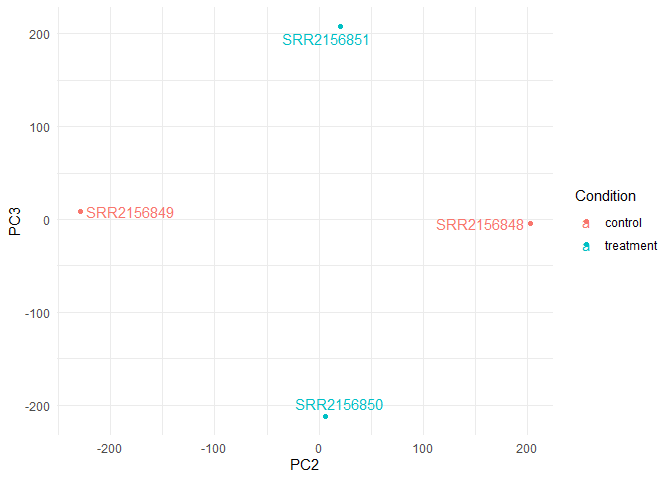

# Class 17: Analyzing sequencing data
Gavin Ambrose PID: A18548522

- [Importing Data from Shell
  computer](#importing-data-from-shell-computer)
  - [Filtering Data](#filtering-data)
- [PCA Ananlysis](#pca-ananlysis)
  - [PCA Visualization](#pca-visualization)
  - [Making a ggplot version](#making-a-ggplot-version)
    - [PC1 vs PC 3](#pc1-vs-pc-3)
    - [PC2 vs PC3](#pc2-vs-pc3)

## Importing Data from Shell computer

With each sample having its own directory containing the Kallisto
output, we can import the transcript count estimates into R using:

``` r
library(tximport)
library(rhdf5)
```

``` r
folders <- dir(pattern="SRR21568*")
samples <- sub("_quant", "", folders)
files <- file.path( folders, "abundance.h5" )
names(files) <- samples

txi.kallisto <- tximport(files, type = "kallisto", txOut = TRUE)
```

    1 2 3 4 

``` r
head(txi.kallisto$counts)
```

                    SRR2156848 SRR2156849 SRR2156850 SRR2156851
    ENST00000539570          0          0    0.00000          0
    ENST00000576455          0          0    2.62037          0
    ENST00000510508          0          0    0.00000          0
    ENST00000474471          0          1    1.00000          0
    ENST00000381700          0          0    0.00000          0
    ENST00000445946          0          0    0.00000          0

``` r
colSums(txi.kallisto$counts)
```

    SRR2156848 SRR2156849 SRR2156850 SRR2156851 
       2563611    2600800    2372309    2111474 

``` r
sum(rowSums(txi.kallisto$counts)>0)
```

    [1] 94561

### Filtering Data

Before subsequent analysis, we might want to filter out those annotated
transcripts with no reads:

``` r
to.keep <- rowSums(txi.kallisto$counts) > 0
kset.nonzero <- txi.kallisto$counts[to.keep,]
```

``` r
keep2 <- apply(kset.nonzero,1,sd)>0
x <- kset.nonzero[keep2,]
```

## PCA Ananlysis

We can now apply any exploratory analysis technique to this counts
matrix. As an example, we will perform a PCA of the transcriptomic
profiles of these samples.

``` r
pca <- prcomp(t(x), scale=TRUE)
summary(pca)
```

    Importance of components:
                                PC1      PC2      PC3   PC4
    Standard deviation     183.6379 177.3605 171.3020 1e+00
    Proportion of Variance   0.3568   0.3328   0.3104 1e-05
    Cumulative Proportion    0.3568   0.6895   1.0000 1e+00

### PCA Visualization

Now we can use the first two principal components as a co-ordinate
system for visualizing the summarized transcriptomic profiles of each
sample:

``` r
plot(pca$x[,1], pca$x[,2],
     col=c("blue","blue","red","red"),
     xlab="PC1", ylab="PC2", pch=16)
```


### Making a ggplot version

``` r
library(ggplot2)
```

    Warning: package 'ggplot2' was built under R version 4.4.3

Let’s create a data frame for the data

``` r
library(ggrepel)
```

    Warning: package 'ggrepel' was built under R version 4.4.3

``` r
# Make metadata object for the samples
colData <- data.frame(condition = factor(rep(c("control", "treatment"), each = 2)))
rownames(colData) <- colnames(txi.kallisto$counts)

# Make the data.frame for ggplot 
y <- as.data.frame(pca$x)
y$Condition <- as.factor(colData$condition)
```

``` r
ggplot(y) +  
  aes(PC1,PC2,col = Condition) + 
  geom_point() +
  geom_text_repel(label=rownames(y)) +
  theme_minimal()
```



#### PC1 vs PC 3

``` r
ggplot(y) +  
  aes(PC1,PC3,col = Condition) + 
  geom_point() +
  geom_text_repel(label=rownames(y)) +
  theme_minimal()
```



#### PC2 vs PC3

``` r
ggplot(y) +  
  aes(PC2,PC3,col = Condition) + 
  geom_point() +
  geom_text_repel(label=rownames(y)) +
  theme_minimal()
```


