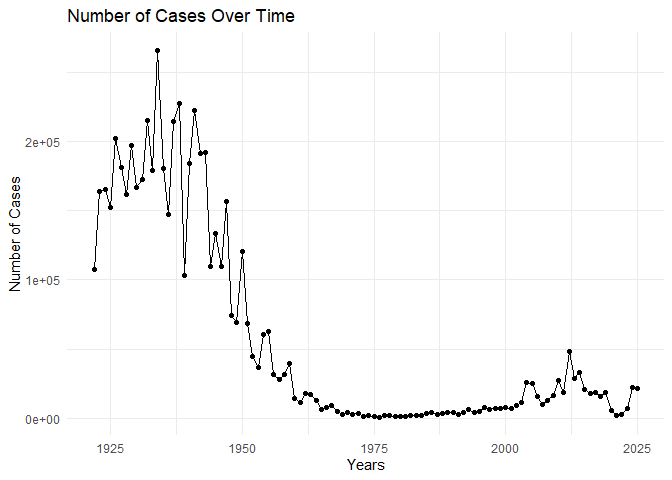
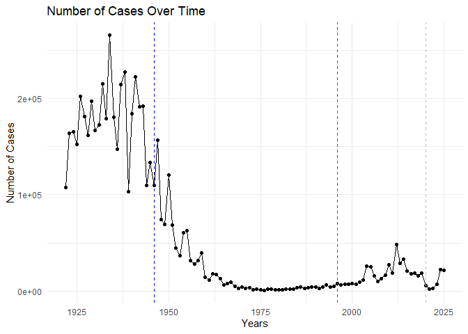
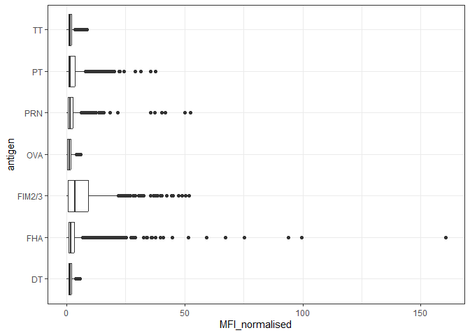
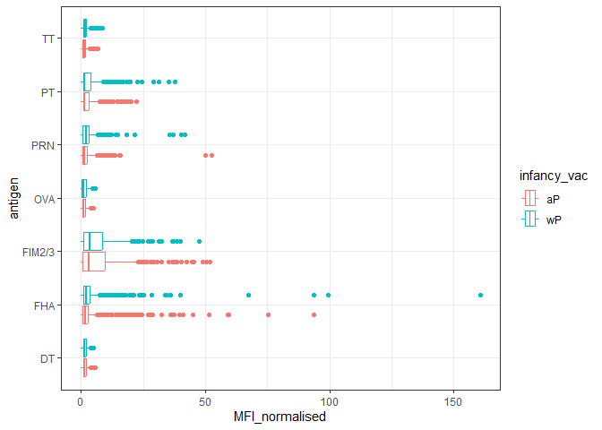
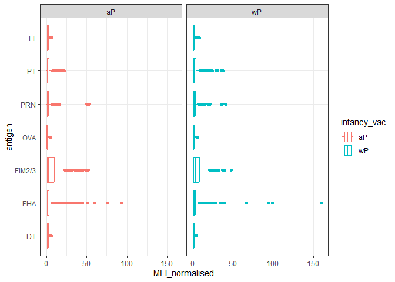
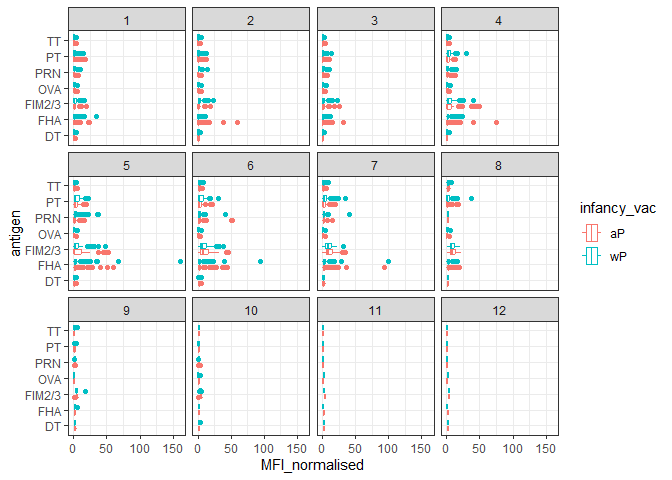
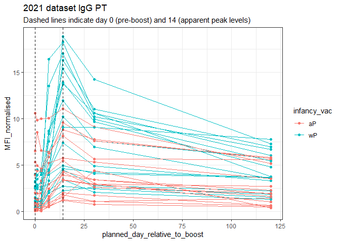
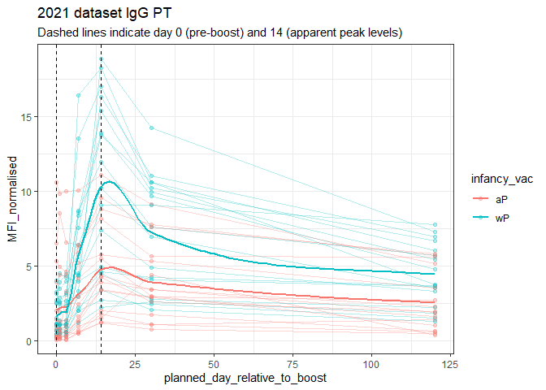

# Class 18: Investigating Pertussis
Gavin Ambrose PID: A18548522

- [Background](#background)
- [1. Investigating pertussis cases by
  year](#1-investigating-pertussis-cases-by-year)
- [2. A tale of two vaccines (wP &
  aP)](#2-a-tale-of-two-vaccines-wp--ap)
- [3. Exploring CMI-PB data](#3-exploring-cmi-pb-data)
  - [Working with dates](#working-with-dates)
  - [Joining multiple tables](#joining-multiple-tables)
- [Examine IgG Ab titer levels](#examine-igg-ab-titer-levels)

## Background

Pertussis (more commonly known as whooping cough) is a highly contagious
respiratory disease caused by the bacterium Bordetella pertussis.

People of all ages can be infected leading to violent coughing fits
followed by a characteristic high-pitched “whoop” like intake of breath.
Children have the highest risk for severe complications and death.

## 1. Investigating pertussis cases by year

Let’s read the information from the following website:
<https://www.cdc.gov/pertussis/surv-reporting/cases-by-year.html>

> Q1. With the help of the R “addin” package datapasta assign the CDC
> pertussis case number data to a data frame called cdc and use ggplot
> to make a plot of cases numbers over time.

``` r
library(ggplot2)
```

    Warning: package 'ggplot2' was built under R version 4.4.3

``` r
library(datapasta)
```

    Warning: package 'datapasta' was built under R version 4.4.3

Here is the data

Let’s creat the ggplot.

``` r
ggplot(cdc) + 
  aes(year, cases) + 
  geom_point() + 
  geom_line() +
  labs(x = "Years", y ="Number of Cases", title = "Number of Cases Over Time" ) +
  theme_minimal()
```



> Q. Add the annotation lines for major milestones of wP vaccination
> roll-out (1946) and the switch to the ap vaccine (1996)

## 2. A tale of two vaccines (wP & aP)

``` r
ggplot(cdc) + 
  aes(year, cases) + 
  geom_point() + 
  geom_line() +
  labs(x = "Years", y ="Number of Cases", title = "Number of Cases Over Time" ) +
  theme_minimal() +
geom_vline(xintercept = 1946, col = "blue", lty = 2) +
  geom_vline(xintercept = 1996, col = "red", lty = 2) +
  geom_vline(xintercept = 2020, col = "gray", lty = 2)
```



> Q2. Using the ggplot geom_vline() function add lines to your previous
> plot for the 1946 introduction of the wP vaccine and the 1996 switch
> to aP vaccine (see example in the hint below). What do you notice?

The number of cases decreases initially by oscillating downwards before
leveling out

> Q3. Describe what happened after the introduction of the aP vaccine?
> Do you have a possible explanation for the observed trend?

There is a general increase in the number of cases. This could be due to
more sensitive testing that has been developed, the increased resistance
of the bacteria, or a reduced effectiveness of the drug (concentration)

## 3. Exploring CMI-PB data

Why is this vaccine-preventable disease on the upswing? To answer this
question we need to investigate the mechanisms underlying waning
protection against pertussis. This requires evaluation of
pertussis-specific immune responses over time in wP and aP vaccinated
individuals.

``` r
library(jsonlite)
```

Let’s now read the main subject database table from the CMI-PB API. You
can find out more about the content and format of this and other tables
here: <https://www.cmi-pb.org/blog/understand-data/>

To read these types of files into R we will use the `read_json()`
function from the jsonlite package

``` r
subject <- read_json("https://www.cmi-pb.org/api/subject",
                     simplifyVector = T) 
head(subject, 3)
```

      subject_id infancy_vac biological_sex              ethnicity  race
    1          1          wP         Female Not Hispanic or Latino White
    2          2          wP         Female Not Hispanic or Latino White
    3          3          wP         Female                Unknown White
      year_of_birth date_of_boost      dataset
    1    1986-01-01    2016-09-12 2020_dataset
    2    1968-01-01    2019-01-28 2020_dataset
    3    1983-01-01    2016-10-10 2020_dataset

> Q4. How many aP and wP infancy vaccinated subjects are in the dataset?

``` r
table(subject$infancy_vac)
```


    aP wP 
    87 85 

There are 58 infants vaccinated with the wP vaccine and 60 vaccinated
with the aP vaccine.

> Q5. How many Male and Female subjects/patients are in the dataset?

``` r
table(subject$biological_sex)
```


    Female   Male 
       112     60 

There are 112 female patients in the dataset and 60 males within the
dataset

> Q6. What is the breakdown of `race` and `biological sex` (e.g. number
> of Asian females, White males etc…)?

``` r
table(subject$race, subject$biological_sex)
```

                                               
                                                Female Male
      American Indian/Alaska Native                  0    1
      Asian                                         32   12
      Black or African American                      2    3
      More Than One Race                            15    4
      Native Hawaiian or Other Pacific Islander      1    1
      Unknown or Not Reported                       14    7
      White                                         48   32

There is a large poportion of the sample that contains Asian and White
population with little sampling from American Indian/Alaska Native,
Black or African American, Native Hawaiian or Other Pacific Islander,
with moderate reporting form More than one race or Unknown or Not
reported

> Q. Is this representative?

No, this data pulls unequally from the different races and genders.

### Working with dates

> Q7. Using this approach determine (i) the average age of wP
> individuals, (ii) the average age of aP individuals; and (iii) are
> they significantly different?

### Joining multiple tables

Let’s read some more tables

``` r
specimen <- read_json("http://cmi-pb.org/api/v5_1/specimen", 
                      simplifyVector = T )
ab_titer <- read_json("http://cmi-pb.org/api/v5_1/plasma_ab_titer",
                      simplifyVector = T)
```

``` r
head(specimen)
```

      specimen_id subject_id actual_day_relative_to_boost
    1           1          1                           -3
    2           2          1                            1
    3           3          1                            3
    4           4          1                            7
    5           5          1                           11
    6           6          1                           32
      planned_day_relative_to_boost specimen_type visit
    1                             0         Blood     1
    2                             1         Blood     2
    3                             3         Blood     3
    4                             7         Blood     4
    5                            14         Blood     5
    6                            30         Blood     6

``` r
head(ab_titer)
```

      specimen_id isotype is_antigen_specific antigen        MFI MFI_normalised
    1           1     IgE               FALSE   Total 1110.21154       2.493425
    2           1     IgE               FALSE   Total 2708.91616       2.493425
    3           1     IgG                TRUE      PT   68.56614       3.736992
    4           1     IgG                TRUE     PRN  332.12718       2.602350
    5           1     IgG                TRUE     FHA 1887.12263      34.050956
    6           1     IgE                TRUE     ACT    0.10000       1.000000
       unit lower_limit_of_detection
    1 UG/ML                 2.096133
    2 IU/ML                29.170000
    3 IU/ML                 0.530000
    4 IU/ML                 6.205949
    5 IU/ML                 4.679535
    6 IU/ML                 2.816431

To know whether a given `specimen_id` comes from an aP or wP individual
we need to link (a.k.a. “join” or “merge”) our `specimen` and `subject`
data frames. Only then will we know that a given AB measurement (from
the `ab-tier` table) was collected on a certain data from a certain date
(from the `specimen` table) from the certain wP or aP subject (from the
`subject` table).

We can use **dplyr** and the `*join()` family of functions to do this.

> Q9. Complete the code to join specimen and subject tables to make a
> new merged data frame containing all specimen records along with their
> associated subject details:

``` r
library(dplyr)
```

``` r
meta <- inner_join(subject, specimen)
```

    Joining with `by = join_by(subject_id)`

``` r
head(meta)
```

      subject_id infancy_vac biological_sex              ethnicity  race
    1          1          wP         Female Not Hispanic or Latino White
    2          1          wP         Female Not Hispanic or Latino White
    3          1          wP         Female Not Hispanic or Latino White
    4          1          wP         Female Not Hispanic or Latino White
    5          1          wP         Female Not Hispanic or Latino White
    6          1          wP         Female Not Hispanic or Latino White
      year_of_birth date_of_boost      dataset specimen_id
    1    1986-01-01    2016-09-12 2020_dataset           1
    2    1986-01-01    2016-09-12 2020_dataset           2
    3    1986-01-01    2016-09-12 2020_dataset           3
    4    1986-01-01    2016-09-12 2020_dataset           4
    5    1986-01-01    2016-09-12 2020_dataset           5
    6    1986-01-01    2016-09-12 2020_dataset           6
      actual_day_relative_to_boost planned_day_relative_to_boost specimen_type
    1                           -3                             0         Blood
    2                            1                             1         Blood
    3                            3                             3         Blood
    4                            7                             7         Blood
    5                           11                            14         Blood
    6                           32                            30         Blood
      visit
    1     1
    2     2
    3     3
    4     4
    5     5
    6     6

> Q10. Now using the same procedure join meta with titer data so we can
> further analyze this data in terms of time of visit aP/wP, male/female
> etc.

``` r
abdata <- inner_join(ab_titer, meta)
```

    Joining with `by = join_by(specimen_id)`

``` r
head(abdata)
```

      specimen_id isotype is_antigen_specific antigen        MFI MFI_normalised
    1           1     IgE               FALSE   Total 1110.21154       2.493425
    2           1     IgE               FALSE   Total 2708.91616       2.493425
    3           1     IgG                TRUE      PT   68.56614       3.736992
    4           1     IgG                TRUE     PRN  332.12718       2.602350
    5           1     IgG                TRUE     FHA 1887.12263      34.050956
    6           1     IgE                TRUE     ACT    0.10000       1.000000
       unit lower_limit_of_detection subject_id infancy_vac biological_sex
    1 UG/ML                 2.096133          1          wP         Female
    2 IU/ML                29.170000          1          wP         Female
    3 IU/ML                 0.530000          1          wP         Female
    4 IU/ML                 6.205949          1          wP         Female
    5 IU/ML                 4.679535          1          wP         Female
    6 IU/ML                 2.816431          1          wP         Female
                   ethnicity  race year_of_birth date_of_boost      dataset
    1 Not Hispanic or Latino White    1986-01-01    2016-09-12 2020_dataset
    2 Not Hispanic or Latino White    1986-01-01    2016-09-12 2020_dataset
    3 Not Hispanic or Latino White    1986-01-01    2016-09-12 2020_dataset
    4 Not Hispanic or Latino White    1986-01-01    2016-09-12 2020_dataset
    5 Not Hispanic or Latino White    1986-01-01    2016-09-12 2020_dataset
    6 Not Hispanic or Latino White    1986-01-01    2016-09-12 2020_dataset
      actual_day_relative_to_boost planned_day_relative_to_boost specimen_type
    1                           -3                             0         Blood
    2                           -3                             0         Blood
    3                           -3                             0         Blood
    4                           -3                             0         Blood
    5                           -3                             0         Blood
    6                           -3                             0         Blood
      visit
    1     1
    2     1
    3     1
    4     1
    5     1
    6     1

> Q11. How many specimens (i.e. entries in abdata) do we have for each
> isotype?

``` r
table(abdata$isotype)
```


      IgE   IgG  IgG1  IgG2  IgG3  IgG4 
     6698  7265 11993 12000 12000 12000 

There are several thousand entries for each isotypes available. There
are 6698 for IgE, 7265 fir IgG, 11993 for IgG1, 12000 for IgG2, 12000
for IgG3, and 12000 for IgG4.

> Q. How many different “antigen” values are measured

``` r
table(abdata$antigen)
```


        ACT   BETV1      DT   FELD1     FHA  FIM2/3   LOLP1     LOS Measles     OVA 
       1970    1970    6318    1970    6712    6318    1970    1970    1970    6318 
        PD1     PRN      PT     PTM   Total      TT 
       1970    6712    6712    1970     788    6318 

> Q12. What are the different \$dataset values in abdata and what do you
> notice about the number of rows for the most “recent” dataset?

``` r
table(abdata$dataset)
```


    2020_dataset 2021_dataset 2022_dataset 2023_dataset 
           31520         8085         7301        15050 

There are quite a few different types of antigens and each contain
varying amounts of values associated with them

## Examine IgG Ab titer levels

Let’s focus on IgG isotype

``` r
igg <- abdata |> 
  filter(isotype == "IgG")
head(igg)
```

      specimen_id isotype is_antigen_specific antigen        MFI MFI_normalised
    1           1     IgG                TRUE      PT   68.56614       3.736992
    2           1     IgG                TRUE     PRN  332.12718       2.602350
    3           1     IgG                TRUE     FHA 1887.12263      34.050956
    4          19     IgG                TRUE      PT   20.11607       1.096366
    5          19     IgG                TRUE     PRN  976.67419       7.652635
    6          19     IgG                TRUE     FHA   60.76626       1.096457
       unit lower_limit_of_detection subject_id infancy_vac biological_sex
    1 IU/ML                 0.530000          1          wP         Female
    2 IU/ML                 6.205949          1          wP         Female
    3 IU/ML                 4.679535          1          wP         Female
    4 IU/ML                 0.530000          3          wP         Female
    5 IU/ML                 6.205949          3          wP         Female
    6 IU/ML                 4.679535          3          wP         Female
                   ethnicity  race year_of_birth date_of_boost      dataset
    1 Not Hispanic or Latino White    1986-01-01    2016-09-12 2020_dataset
    2 Not Hispanic or Latino White    1986-01-01    2016-09-12 2020_dataset
    3 Not Hispanic or Latino White    1986-01-01    2016-09-12 2020_dataset
    4                Unknown White    1983-01-01    2016-10-10 2020_dataset
    5                Unknown White    1983-01-01    2016-10-10 2020_dataset
    6                Unknown White    1983-01-01    2016-10-10 2020_dataset
      actual_day_relative_to_boost planned_day_relative_to_boost specimen_type
    1                           -3                             0         Blood
    2                           -3                             0         Blood
    3                           -3                             0         Blood
    4                           -3                             0         Blood
    5                           -3                             0         Blood
    6                           -3                             0         Blood
      visit
    1     1
    2     1
    3     1
    4     1
    5     1
    6     1

> Q13. Complete the following code to make a summary boxplot of Ab titer
> levels (MFI) for all antigens:

Make a plot of `MFI_normalized` vs `antigen`

``` r
ggplot(igg) +
  aes(MFI_normalised, antigen) +
  geom_boxplot() +
  theme_bw()
```



> Q14. What antigens show differences in the level of IgG antibody
> titers recognizing them over time? Why these and not others?

The antigens “PT”, “FIM2/3”, and “FHA” apppear to have the widest range
of values

> Q. Is there a difference for these responses between aP and wP
> individuals?

``` r
ggplot(igg) +
  aes(MFI_normalised, antigen, col=infancy_vac) +
  geom_boxplot() +
  theme_bw()
```



``` r
ggplot(igg) +
  aes(MFI_normalised, antigen, col=infancy_vac) +
  geom_boxplot() +
  facet_wrap(~infancy_vac) +
  theme_bw()
```



> Q. Is there a difference with time (i.e. before booster shot vs after
> booster shot)

``` r
ggplot(igg) +
  aes(MFI_normalised, antigen, col=infancy_vac) +
  geom_boxplot() +
  facet_wrap(~visit) +
  theme_bw()
```



Let’s do one last plot:

``` r
abdata.21 <- abdata %>% filter(dataset == "2021_dataset") # Filtering per year

abdata.21 %>% 
  filter(isotype == "IgG",  antigen == "PT") %>% #Looking at specific isotype
  ggplot() +
    aes(x=planned_day_relative_to_boost,
        y=MFI_normalised,
        col=infancy_vac,
        group=subject_id) + #draw lines for each indicudual patient
    geom_point() +
    geom_line() +
    geom_vline(xintercept=0, linetype="dashed") +
    geom_vline(xintercept=14, linetype="dashed") +
  labs(title="2021 dataset IgG PT",
       subtitle = "Dashed lines indicate day 0 (pre-boost) and 14 (apparent peak levels)") +
  theme_bw()
```



> Q. Can you add a `geom_smooth()` to show the difference between aP and
> wP

``` r
abdata.21 <- abdata %>% filter(dataset == "2021_dataset") # Filtering per year

abdata.21 %>% 
  filter(isotype == "IgG",
         antigen == "PT") %>% #Looking at specific isotype
  ggplot() +
    aes(x=planned_day_relative_to_boost,
        y=MFI_normalised,
        col=infancy_vac,
        group=subject_id) + #draw lines for each indicudual patient
    geom_point(alpha = 0.3) +
    geom_line(alpha = 0.3) +
    geom_vline(xintercept=0, linetype="dashed") +
    geom_vline(xintercept=14, linetype="dashed") +
  labs(title="2021 dataset IgG PT",
       subtitle = "Dashed lines indicate day 0 (pre-boost) and 14 (apparent peak levels)") +
  theme_bw() +
  geom_smooth(
  aes(group = infancy_vac),
  se = FALSE,
  span = 0.3
)
```

    `geom_smooth()` using method = 'loess' and formula = 'y ~ x'

    Warning in simpleLoess(y, x, w, span, degree = degree, parametric = parametric,
    : pseudoinverse used at -0.6

    Warning in simpleLoess(y, x, w, span, degree = degree, parametric = parametric,
    : neighborhood radius 3.6

    Warning in simpleLoess(y, x, w, span, degree = degree, parametric = parametric,
    : reciprocal condition number 0

    Warning in simpleLoess(y, x, w, span, degree = degree, parametric = parametric,
    : There are other near singularities as well. 11364

    Warning in simpleLoess(y, x, w, span, degree = degree, parametric = parametric,
    : pseudoinverse used at -0.6

    Warning in simpleLoess(y, x, w, span, degree = degree, parametric = parametric,
    : neighborhood radius 3.6

    Warning in simpleLoess(y, x, w, span, degree = degree, parametric = parametric,
    : reciprocal condition number 2.4057e-16

    Warning in simpleLoess(y, x, w, span, degree = degree, parametric = parametric,
    : There are other near singularities as well. 11364


